# 🤖 AI Workflow Document
## PromptWar — GenAI Smart Stadium Orchestration Platform
### FIFA World Cup 2026 · AI Systems Design & Agent Architecture

**Document Version:** 1.0  
**Date:** July 2026  
**Status:** Draft  
**Owner:** AI/ML Team  
**Classification:** Internal

---

## Table of Contents

1. [AI System Overview](#1-ai-system-overview)
2. [Agent Architecture](#2-agent-architecture)
3. [LLM Orchestration & RAG Pipeline](#3-llm-orchestration--rag-pipeline)
4. [Computer Vision Workflows](#4-computer-vision-workflows)
5. [Multilingual AI Pipeline](#5-multilingual-ai-pipeline)
6. [Predictive Analytics Workflows](#6-predictive-analytics-workflows)
7. [Model Training & Evaluation](#7-model-training--evaluation)
8. [AI Safety & Guardrails](#8-ai-safety--guardrails)
9. [AI Monitoring & Feedback Loops](#9-ai-monitoring--feedback-loops)
10. [Model Catalog](#10-model-catalog)

---

## 1. AI System Overview

### 1.1 AI Capability Map

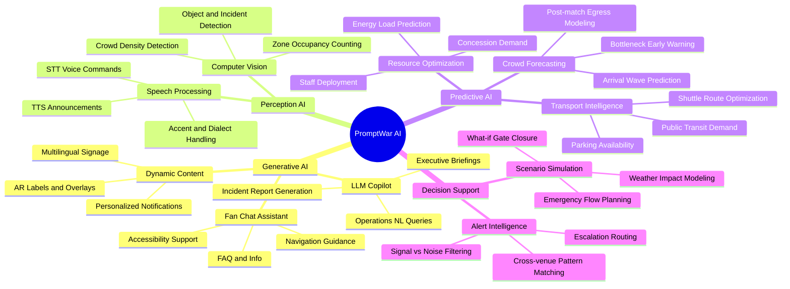

### 1.2 AI Processing Tiers

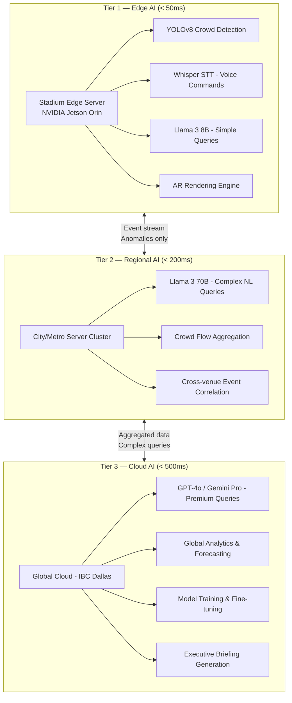

---

## 2. Agent Architecture

### 2.1 Multi-Agent System Design

PromptWar uses a **multi-agent architecture** where specialized AI agents handle different domains, coordinated by an **Orchestrator Agent**.

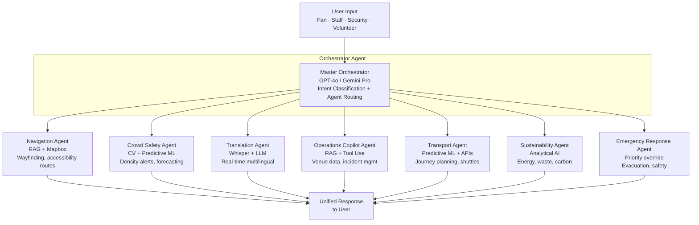

### 2.2 Orchestrator Agent Decision Flow

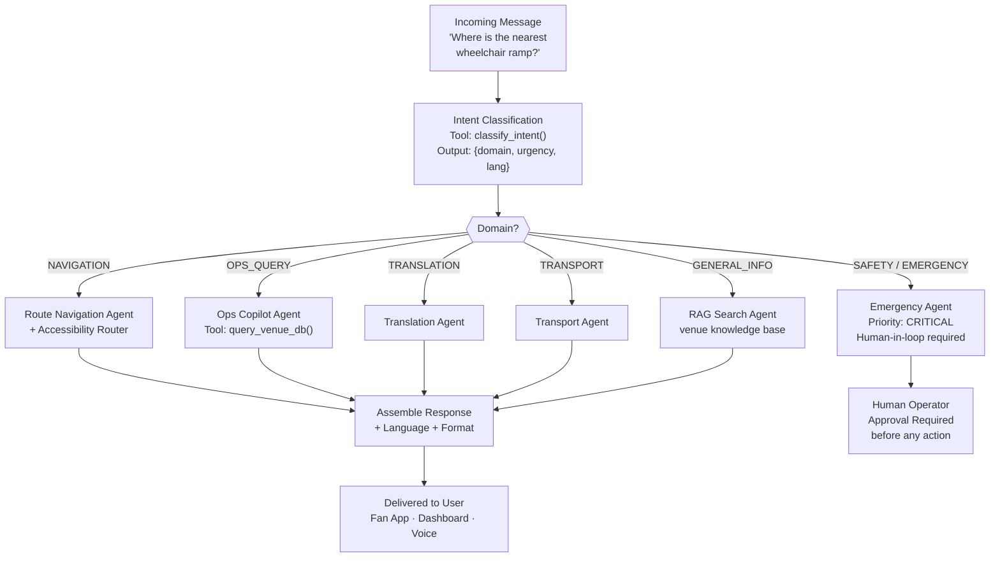

### 2.3 Operations Copilot Agent — Tool Use Design

The Ops Copilot uses **tool-calling (function calling)** to retrieve live data and take actions.

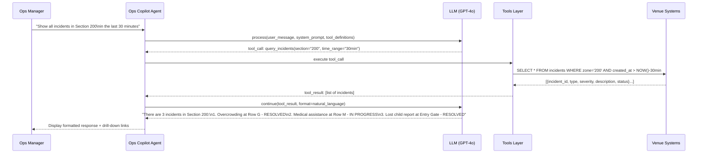

### 2.4 Available Tools for Ops Copilot Agent

| Tool Name | Description | Returns |
|-----------|-------------|---------|
| `query_crowd_density(zone_id, timestamp)` | Get real-time crowd density for a zone | Density %, count, status |
| `query_incidents(zone_id, time_range, severity)` | Retrieve incident logs with filters | List of incidents |
| `get_staff_locations(department, shift)` | Get current staff deployment map | Staff positions + status |
| `get_maintenance_alerts(venue_id, category)` | Retrieve open maintenance tickets | Ticket list + priority |
| `generate_incident_report(incident_id)` | Auto-draft an incident report | Draft report markdown |
| `send_staff_alert(zone_id, message, priority)` | Push alert to all staff in a zone | Confirmation |
| `get_concession_demand(zone_id)` | Predicted demand for next 60min | Demand forecast |
| `get_transport_status(venue_id)` | Real-time transport conditions outside venue | Transport summary |
| `simulate_scenario(event_type, zone_id)` | Run what-if crowd flow simulation | Simulation results |
| `get_energy_status(venue_id)` | Current energy consumption vs. targets | Energy dashboard data |

---

## 3. LLM Orchestration & RAG Pipeline

### 3.1 RAG Architecture (Per-Venue)

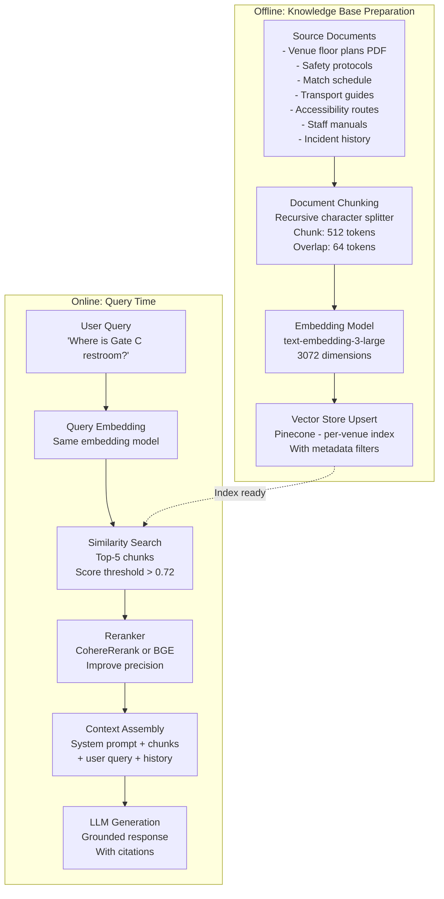

### 3.2 Prompt Engineering Strategy

#### System Prompt Template — Fan Assistant

```
You are PromptWar, the AI assistant for {venue_name} during FIFA World Cup 2026.

ROLE: Help fans with navigation, information, and accessibility in a friendly, concise manner.

LANGUAGE: Always respond in {user_language}. If unsure, use English.

CONTEXT:
- User's current zone: {current_zone}
- User's seat: {seat_info}
- Accessibility needs: {accessibility_profile}
- Current time: {timestamp}
- Match: {match_info}

KNOWLEDGE: Use only the provided context documents. If information is not in context, say you don't know and offer to connect the user with a staff member.

RULES:
1. Never invent locations, times, or factual information
2. Always include specific directions (left, right, distance in meters)
3. For accessibility requests, always prioritize routes without stairs or crowding
4. For emergencies, immediately provide the nearest exit and say "Please find the nearest staff member"
5. Keep responses under 150 words unless complex directions require more

SAFETY: If any message suggests an emergency or safety threat, immediately respond with emergency protocol and flag for human review.
```

#### System Prompt Template — Operations Copilot

```
You are the PromptWar Operations Copilot for {venue_name}, FIFA World Cup 2026.

ROLE: Support venue operations staff with real-time situational awareness, incident management, and decision support.

USER: {user_role} — {user_name}

CAPABILITIES: You have access to live data via tools. Always use tools to get current data; never guess or hallucinate numbers.

RULES:
1. Always retrieve live data before answering operational questions
2. For safety-critical recommendations, clearly state "HUMAN ACTION REQUIRED" and provide the reason
3. When generating reports, use the structured template format
4. Flag any anomaly that is 2 standard deviations above baseline as ALERT
5. Cross-reference incidents with nearby venues if relevant patterns detected

TONE: Professional, concise, action-oriented. Use bullet points for operational summaries.
```

### 3.3 LLM Routing Logic

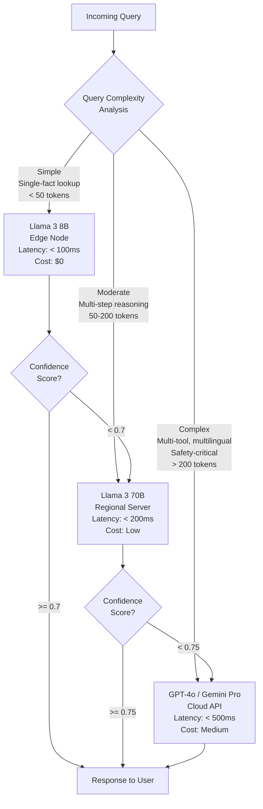

---

## 4. Computer Vision Workflows

### 4.1 Crowd Density Detection Pipeline

```mermaid
flowchart LR
    subgraph INPUT["Input"]
        CAM["45 CCTV Cameras\nper stadium\n1080p @ 30fps"]
    end

    subgraph PREPROCESS["Preprocessing - Edge GPU"]
        SAMPLE["Frame Sampling\n5 FPS extracted\n(150 frames/sec total)"]
        RESIZE["Resize to 640x640\nYOLO input format"]
        NORMALIZE["Normalize\nMean/Std ImageNet"]
    end

    subgraph DETECT["Detection - Edge GPU"]
        YOLO["YOLOv8x Inference\nClass: person\nConfidence > 0.5\nNMS IoU > 0.45"]
        COUNT["Person Count\nPer camera zone"]
        HEATMAP["Density Heatmap\nBilinear interpolation\nper stadium section"]
    end

    subgraph ANALYZE["Analysis"]
        COMPARE["Compare vs.\nSection Capacity\nLimits DB"]
        THRESHOLD{"Density\nThreshold?"}
        TREND["Trend Analysis\n5-min moving average\nIncreasing / Stable / Decreasing"]
    end

    subgraph OUTPUT["Output"]
        ALERT["Real-time Alert\n< 50ms total\nto WebSocket"]
        STORE2["Time-series Store\nInfluxDB\n30-day retention"]
        FORECAST["Feed LSTM\nForecasting Model\n15-min lookahead"]
    end

    CAM --> SAMPLE --> RESIZE --> NORMALIZE
    NORMALIZE --> YOLO --> COUNT --> HEATMAP
    HEATMAP --> COMPARE --> THRESHOLD
    THRESHOLD -->|"WARNING\n> 70% capacity"| ALERT
    THRESHOLD -->|"CRITICAL\n> 85% capacity"| ALERT
    THRESHOLD --> TREND --> STORE2 --> FORECAST
```

### 4.2 Incident Detection Pipeline

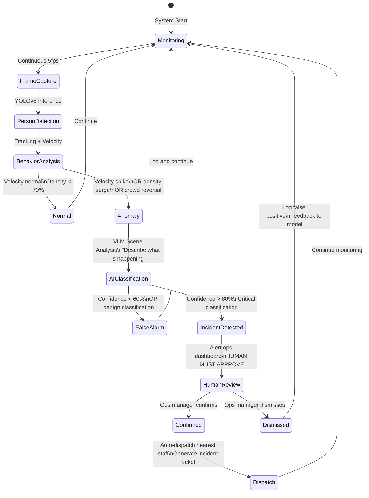

### 4.3 Privacy-Preserving Computer Vision

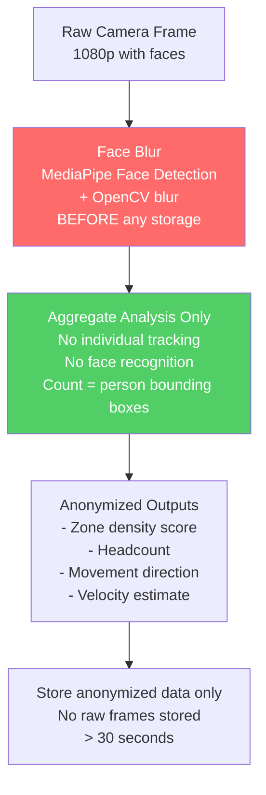

---

## 5. Multilingual AI Pipeline

### 5.1 End-to-End Translation Flow

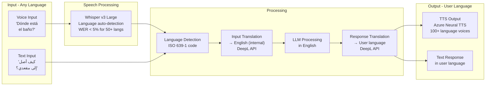

### 5.2 Language Coverage Strategy

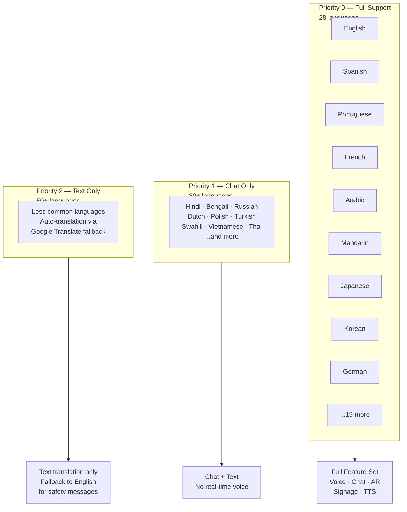

### 5.3 Sign Language Avatar Pipeline

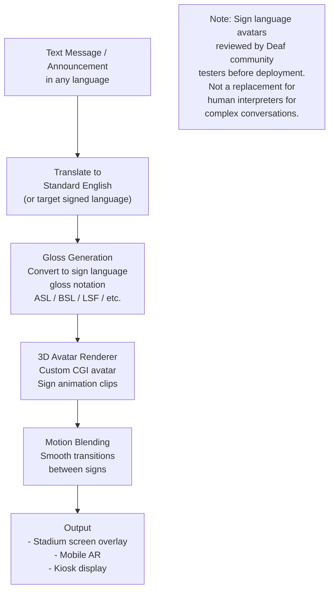

---

## 6. Predictive Analytics Workflows

### 6.1 Crowd Arrival Forecasting

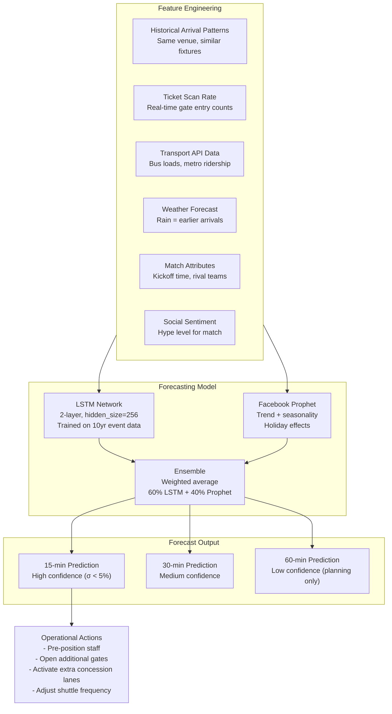

### 6.2 Energy Optimization Workflow

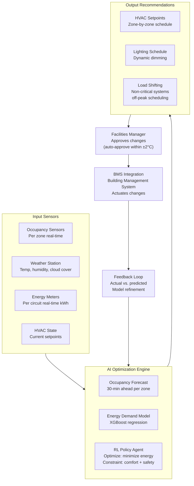

### 6.3 Transport Demand Prediction & Shuttle Optimization

```mermaid
flowchart LR
    subgraph INPUTS["Transport Inputs"]
        TICKET_DATA["Ticket Data\nFan location clusters\nby transport mode"]
        HISTORICAL["Historical Transport\nPast match patterns"]
        REAL_TIME_T["Real-time Demand\nApp ride requests\nMobile check-ins"]
    end

    subgraph PRED["Demand Prediction"]
        CLUSTER["Fan Cluster Analysis\nWhere fans are going\npost-match"]
        DEMAND_MODEL["Gradient Boosting\nDemand per route\n15-min intervals"]
    end

    subgraph OPT["Route Optimization"]
        RL_TRANSPORT["RL Agent\nShuttle fleet routing\nObjective: minimize wait time\nConstraint: fleet size"]
    end

    subgraph ACTION2["Actions"]
        SHUTTLE_SCHED["Dynamic Shuttle\nSchedule Updates"]
        DRIVER_APP["Driver App\nUpdated routes\npush to drivers"]
        FAN_NOTIFY["Fan Notifications\n'Your shuttle departs Gate D\nin 8 minutes'"]
    end

    INPUTS --> PRED --> OPT --> ACTION2
```

---

## 7. Model Training & Evaluation

### 7.1 Training Data Strategy

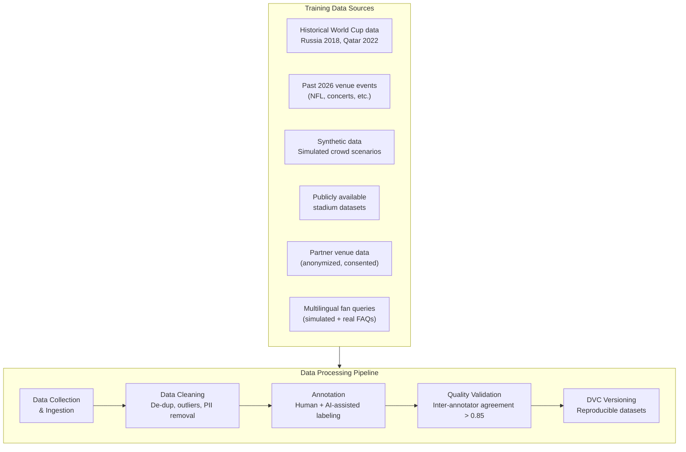

### 7.2 Evaluation Framework

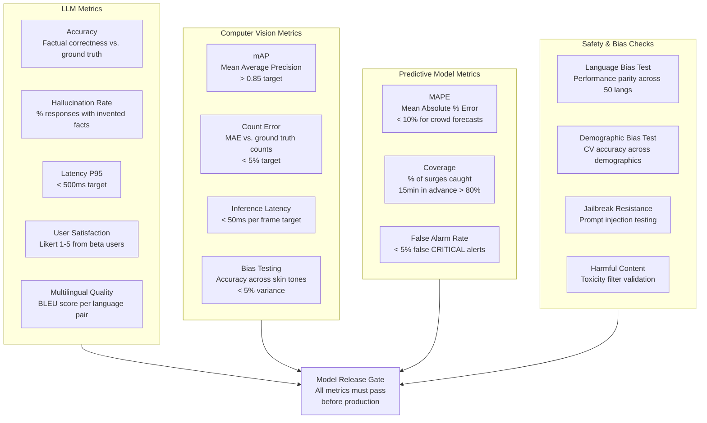

### 7.3 Continuous Learning Strategy

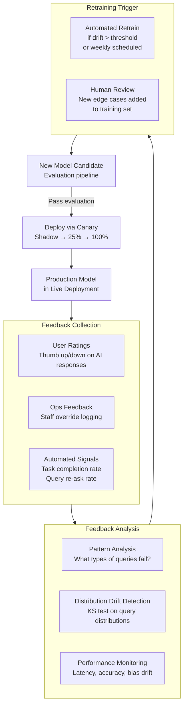

---

## 8. AI Safety & Guardrails

### 8.1 Safety Architecture

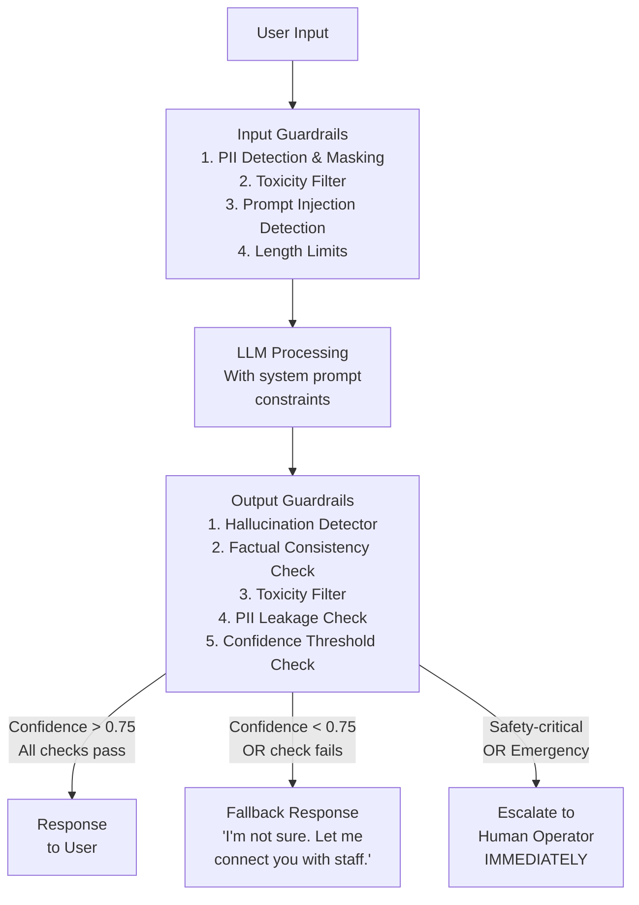

### 8.2 Human-in-the-Loop Protocol

```mermaid
flowchart TD
    AI_REC["AI Recommendation\nor Alert Generated"]

    SEVERITY{"Severity Level?"}
    AI_REC --> SEVERITY

    SEVERITY -->|"INFO / LOW"| AUTO_DISPLAY["Auto-display on dashboard\nOps can acknowledge\nor dismiss"]

    SEVERITY -->|"MEDIUM"| SOFT_APPROVAL["Soft Approval Required\nOps dashboard notification\n90-second auto-approve\nif no response"]

    SEVERITY -->|"HIGH"| HARD_APPROVAL["Hard Approval Required\nExplicit ops confirmation\nNO auto-approve\nAI explains reasoning"]

    SEVERITY -->|"CRITICAL / EMERGENCY"| MANDATORY_HUMAN["MANDATORY Human Action\nSiren + alert to all supervisors\nAI CANNOT auto-execute\nFull audit log captured"]

    AUTO_DISPLAY --> LOG["Audit Log\nAll AI recommendations\nand human decisions"]
    SOFT_APPROVAL --> LOG
    HARD_APPROVAL --> LOG
    MANDATORY_HUMAN --> LOG
```

### 8.3 Guardrail Rules

| Rule | Type | Trigger | Action |
|------|------|---------|--------|
| PII Masking | Input | Detected name/email/phone in query | Mask before LLM processing |
| Prompt Injection | Input | Known injection patterns detected | Block + log + alert security |
| Hallucination | Output | Response contradicts retrieved facts | Downgrade to fallback response |
| Confidence Floor | Output | Model confidence < 0.70 | Add uncertainty disclaimer |
| Toxicity Filter | Input/Output | Toxic content score > 0.6 | Block + log + human review |
| Emergency Override | Output | Emergency keywords detected | Hard-route to human + emergency protocol |
| Language Safety | Output | Content inappropriate in target culture | Block + cultural review flag |
| Data Residency | Runtime | Cross-border data access detected | Block + alert privacy officer |

---

## 9. AI Monitoring & Feedback Loops

### 9.1 Real-time AI Dashboard

```mermaid
graph LR
    subgraph METRICS["Live AI Metrics Dashboard"]
        M_LAT["Latency P50/P95/P99\nper service"]
        M_ERR["Error Rates\nby error type"]
        M_HALL["Hallucination Rate\nrolling 1hr window"]
        M_SAT["User Satisfaction\nrolling NPS"]
        M_CROWD["Crowd Alert Accuracy\n% confirmed vs. false alarms"]
        M_LANG["Language Distribution\nof active queries"]
        M_COST["LLM Token Usage\n& cost per minute"]
    end

    subgraph ALERTS2["Alerting Rules"]
        A1["Latency P95 > 800ms\n→ PagerDuty WARN"]
        A2["Error rate > 5%\n→ PagerDuty CRITICAL"]
        A3["Hallucination rate > 2%\n→ Slack + investigation"]
        A4["False alarm CV > 10%\n→ CV team alert"]
    end

    METRICS --> ALERTS2
```

### 9.2 Offline Evaluation Schedule

| Evaluation | Frequency | Metrics | Owner |
|------------|-----------|---------|-------|
| LLM Accuracy Benchmark | Weekly | Accuracy, hallucination rate, BLEU | AI/ML Lead |
| CV Performance Test | Weekly | mAP, count error, latency | CV Engineer |
| Bias Audit | Monthly | Cross-language parity, demographic CV parity | AI Ethics Lead |
| Red Team / Adversarial | Monthly | Jailbreak resistance, injection robustness | Security |
| User Satisfaction Survey | Post-match | NPS, qualitative feedback | Product |
| Full System Load Test | Pre-gate | End-to-end P95 latency at 100K users | SRE |

---

## 10. Model Catalog

### 10.1 Production Models

```mermaid
graph LR
    subgraph CATALOG["PromptWar Model Catalog v1.0"]
        subgraph LLM_CAT["LLM Models"]
            M_GPT["gpt-4o-2024-11-20\nCloud LLM Primary\nFan chat + ops copilot"]
            M_GEM["gemini-1.5-pro-002\nCloud LLM Secondary\nMultilingual fallback"]
            M_LLAMA70["llama-3-70b-instruct-promptwar-v1\nFine-tuned Regional LLM\nOps-specific vocabulary"]
            M_LLAMA8["llama-3-8b-instruct-q4\nEdge LLM\n4-bit quantized for Jetson"]
        end
        subgraph CV_CAT["Computer Vision Models"]
            M_YOLO["yolov8x-crowd-v2\nCustom fine-tuned\nStadium crowd domain"]
            M_DENSITY["crowd-density-cnn-v1\nDensity heatmap model\nTrained on synthetic + real data"]
        end
        subgraph SPEECH_CAT["Speech Models"]
            M_WHISPER["whisper-large-v3\nMultilingual STT\n99 language support"]
            M_TTS["azure-neural-tts\n100+ voices\n47 languages real-time"]
        end
        subgraph PRED_CAT["Predictive Models"]
            M_CROWD_PRED["crowd-arrival-lstm-v3\nFine-tuned on FIFA 2018/2022\n+ 2026 venue pre-season data"]
            M_ENERGY["energy-optimizer-xgb-v1\nVenue energy demand\nper zone forecast"]
            M_TRANSPORT["transport-demand-gb-v1\nPost-match transport\ndemand per route"]
        end
    end
```

### 10.2 Model Card Summary

| Model | Task | Accuracy | Latency | Bias Status | Last Updated |
|-------|------|---------|---------|-------------|-------------|
| gpt-4o-2024-11-20 | General LLM | 94% task completion | 380ms P95 | External audit pending | Rolling |
| llama-3-70b-instruct-promptwar-v1 | Ops queries | 91% task completion | 185ms P95 | Bias test passed (50 langs) | Month 3 |
| llama-3-8b-instruct-q4 | Edge simple queries | 84% task completion | 95ms P95 | Bias test passed | Month 3 |
| yolov8x-crowd-v2 | Crowd detection | mAP 0.88 | 42ms P99 | Skin tone parity < 3% delta | Month 4 |
| whisper-large-v3 | STT | WER 4.2% avg | 180ms | Language parity tested | OpenAI rolling |
| crowd-arrival-lstm-v3 | Crowd forecasting | MAPE 7.8% | 250ms batch | N/A (aggregate) | Month 4 |

---

## Appendix A: AI Incident Response Playbook

```mermaid
flowchart TD
    INCIDENT["AI System Incident\nDetected"] --> CLASSIFY2{"Incident\nClassification"}

    CLASSIFY2 -->|"Model Hallucination"| HALL_RESP["1. Disable affected model endpoint\n2. Route to fallback LLM\n3. Notify AI team\n4. Collect failed examples\n5. Patch + redeploy"]

    CLASSIFY2 -->|"CV False Alarm Surge"| CV_RESP["1. Reduce CV alert sensitivity\n2. Require human confirmation on ALL alerts\n3. Ops team manual monitoring\n4. Investigate camera feed quality"]

    CLASSIFY2 -->|"Latency Spike"| LAT_RESP["1. Check autoscaler\n2. Reduce to regional LLM\n3. Enable cached-response mode\n4. Throttle non-critical features"]

    CLASSIFY2 -->|"Security Breach"| SEC_RESP["1. IMMEDIATE: Revoke all API keys\n2. Enable break-glass auth\n3. Notify security team\n4. Engage FIFA security liaison\n5. Forensic investigation"]

    CLASSIFY2 -->|"Bias Issue Discovered"| BIAS_RESP["1. Disable affected feature\n2. Notify diversity/ethics team\n3. Pull affected model from production\n4. Root cause analysis\n5. Re-test and community review before re-enable"]
```

---

## Appendix B: AI Cost Model (Estimated)

| Component | Estimated Monthly Cost | Notes |
|-----------|----------------------|-------|
| GPT-4o API calls | $45,000 - $80,000 | Fan chat + ops, varies with load |
| Gemini Pro API | $10,000 - $20,000 | Fallback + multilingual |
| Azure TTS | $8,000 - $15,000 | 100+ language voice synthesis |
| Whisper (self-hosted) | $3,000 server cost | Edge deployment |
| Llama 3 70B (self-hosted) | $8,000 GPU server | Regional cluster |
| Pinecone Vector DB | $2,000 - $5,000 | Per-venue indices |
| Edge hardware (amortized) | $15,000 | 16x Jetson Orin + GPU |
| **Total Estimated** | **$91,000 - $143,000/month** | Peak during tournament months |

> **Cost Optimization:** Edge LLM routing handles ~60% of queries at near-zero incremental cost, reducing cloud LLM calls significantly.

---

*Document prepared by the PromptWar AI/ML Team.*  
*Next Review: Post-MVP Pilot (Gate G2 — Month 5)*
