# 📋 Product Requirements Document (PRD)
## PromptWar — GenAI Smart Stadium Orchestration Platform
### FIFA World Cup 2026 · Google for Developers Challenge

**Document Version:** 1.0  
**Date:** July 2026  
**Status:** Draft — Awaiting Stakeholder Review  
**Owner:** Product Team  
**Classification:** Internal

---

## Table of Contents

1. [Executive Summary](#1-executive-summary)
2. [Problem Statement](#2-problem-statement)
3. [Goals & Success Metrics](#3-goals--success-metrics)
4. [User Personas & Journeys](#4-user-personas--journeys)
5. [Feature Requirements](#5-feature-requirements)
6. [Non-Functional Requirements](#6-non-functional-requirements)
7. [Out of Scope](#7-out-of-scope)
8. [Prioritization Matrix](#8-prioritization-matrix)
9. [Release Plan](#9-release-plan)
10. [Risks & Mitigations](#10-risks--mitigations)
11. [Open Questions](#11-open-questions)

---

## 1. Executive Summary

PromptWar is a **Generative AI-enabled, multi-modal stadium orchestration platform** for the FIFA World Cup 2026. It unifies operations across **16 stadiums, 3 countries, 104 matches**, and serves four distinct user groups: fans, venue staff, security personnel, and volunteers.

The platform addresses a clear market gap: **no existing solution combines GenAI with full stadium operations orchestration**. Current tools are siloed, lack multilingual GenAI, and cannot provide real-time decision support at tournament scale.

### Business Objectives

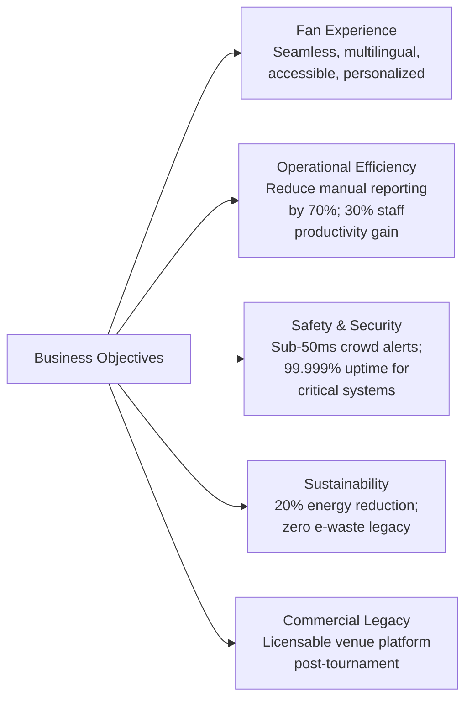

---

## 2. Problem Statement

### 2.1 Core Problems

The FIFA World Cup 2026 operates at a complexity that current technology cannot handle:

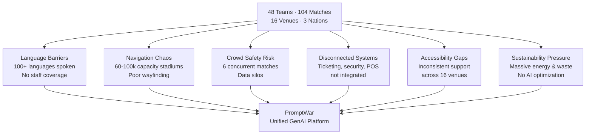

### 2.2 Market Gap

| Existing Tool | Strength | Gap |
|--------------|----------|-----|
| OnePlan | Visual venue planning | No GenAI; static planning |
| ArenaWise | Computer vision crowd AI | Limited LLM capabilities |
| Virtual Venue | Digital twin, crowd flow | No conversational AI |
| Beonic | WiFi/camera analytics | No multilingual GenAI |
| Hawk-Eye | Officiating tech | Officiating only |

**No platform unifies these layers with GenAI.** PromptWar is the first.

---

## 3. Goals & Success Metrics

### 3.1 Primary KPIs

| Goal | Metric | Target |
|------|--------|--------|
| Fan Satisfaction | NPS Score | > 75 |
| Navigation Success | % fans who reach destination without staff help | > 90% |
| Multilingual Coverage | Languages supported | 50+ |
| Response Latency (Chat) | P95 LLM response time | < 500ms |
| Crowd Safety Alerts | Time from detection to alert | < 10s |
| Staff Efficiency | Reduction in manual report generation | 70% |
| System Uptime | Availability for safety-critical features | 99.999% |
| Accessibility | % accessibility requests fulfilled without human | 80% |
| Sustainability | Energy reduction vs. baseline | 20% |
| App Adoption | % fans with app who use AI chat | > 40% |

### 3.2 OKRs by Stakeholder

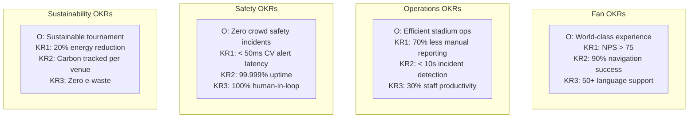

---

## 4. User Personas & Journeys

### 4.1 Persona Overview

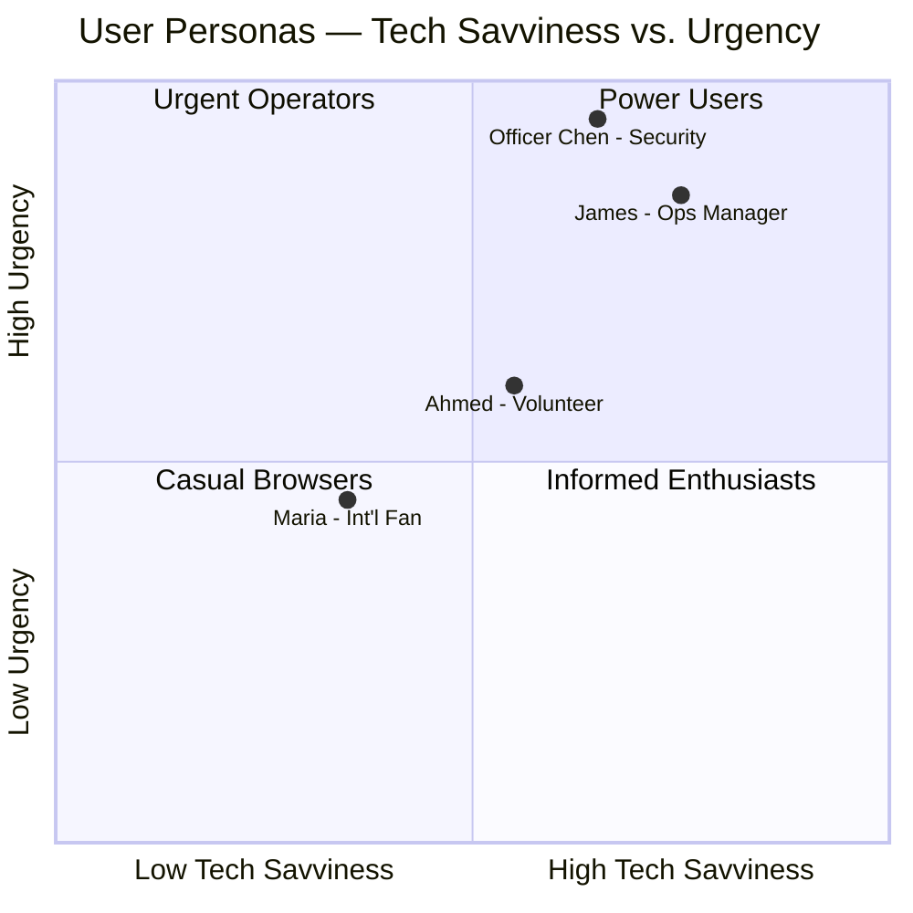

### 4.2 Fan Journey — Maria (International Fan)

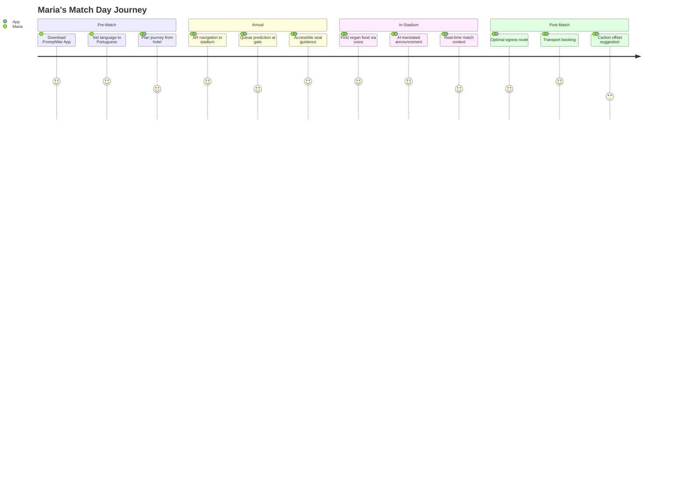

### 4.3 Staff Journey — James (Operations Manager)

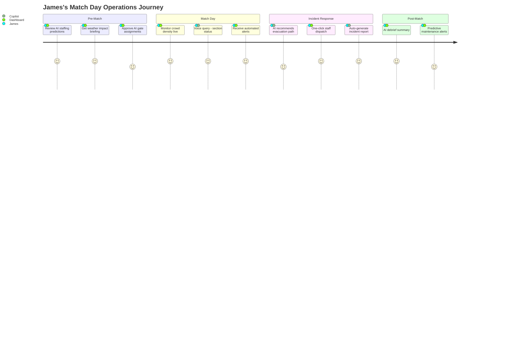

---

## 5. Feature Requirements

### 5.1 Feature Map

```mermaid
graph TB
    PW["PromptWar Platform"] --> F1["Fan Experience Module"]
    PW --> F2["Operations Copilot Module"]
    PW --> F3["Crowd Safety Module"]
    PW --> F4["Multilingual AI Module"]
    PW --> F5["Sustainability Module"]
    PW --> F6["Transport Intelligence Module"]

    F1 --> F1a["AR Wayfinding"]
    F1 --> F1b["Voice Chat Assistant"]
    F1 --> F1c["Accessibility Services"]
    F1 --> F1d["Personalized Feed"]

    F2 --> F2a["NL Ops Query"]
    F2 --> F2b["Automated Reports"]
    F2 --> F2c["Predictive Maintenance"]
    F2 --> F2d["Resource Optimizer"]

    F3 --> F3a["Computer Vision Crowd Count"]
    F3 --> F3b["Predictive Crowd Modeling"]
    F3 --> F3c["Incident Voice Reporting"]
    F3 --> F3d["Cross-venue Intelligence"]

    F4 --> F4a["Real-time Translation"]
    F4 --> F4b["Sign Language Avatars"]
    F4 --> F4c["Dynamic Multilingual Signage"]
    F4 --> F4d["Cultural Context AI"]

    F5 --> F5a["Energy Optimizer"]
    F5 --> F5b["Waste Predictor"]
    F5 --> F5c["Carbon Tracker"]
    F5 --> F5d["Water Manager"]

    F6 --> F6a["Multimodal Journey Planner"]
    F6 --> F6b["Predictive Parking"]
    F6 --> F6c["Dynamic Shuttle Routing"]
```

### 5.2 Detailed Feature Requirements

#### Feature F1: Fan Experience Module

| Feature ID | Feature | Priority | User Story |
|-----------|---------|----------|------------|
| F1.1 | AR Wayfinding | P0 | As a fan, I want AR overlays guiding me to my seat so I never get lost in an unfamiliar 80,000-seat stadium |
| F1.2 | Voice Chat Assistant | P0 | As a fan, I want to speak in my native language and get immediate, accurate answers about the venue |
| F1.3 | Real-time Translation | P0 | As a non-English speaker, I want all announcements auto-translated into my language |
| F1.4 | Accessible Route Finder | P0 | As a wheelchair user, I want routes that avoid stairs and congested corridors |
| F1.5 | Sign Language Interface | P1 | As a deaf fan, I want AI-generated sign language avatars for important announcements |
| F1.6 | Audio Match Description | P1 | As a visually impaired fan, I want AI-narrated match events in real-time |
| F1.7 | Food & Concession AI | P1 | As a fan, I want to find food matching my dietary needs with real-time queue estimates |
| F1.8 | Sensory-friendly Mode | P1 | As a fan with sensory sensitivities, I want alerts when nearby sections are becoming very loud |
| F1.9 | Post-match Egress AI | P2 | As a fan, I want the optimal exit route based on real-time crowd data |

#### Feature F2: Operations Copilot Module

| Feature ID | Feature | Priority | User Story |
|-----------|---------|----------|------------|
| F2.1 | Natural Language Query | P0 | As an ops manager, I want to ask "What's happening at Gate C?" and get an instant AI-synthesized answer |
| F2.2 | Automated Incident Reports | P0 | As an ops manager, I want AI to auto-draft incident reports from voice notes |
| F2.3 | Predictive Staffing | P1 | As an ops manager, I want AI to predict where I need more staff in the next 30 minutes |
| F2.4 | Predictive Maintenance | P1 | As a facilities manager, I want AI to flag equipment likely to fail before it does |
| F2.5 | Exec Briefings | P2 | As a FIFA director, I want a daily AI-generated briefing on all 16 venues |

#### Feature F3: Crowd Safety Module

| Feature ID | Feature | Priority | User Story |
|-----------|---------|----------|------------|
| F3.1 | Computer Vision Crowd Count | P0 | As a security chief, I want real-time crowd density per zone, updated every second |
| F3.2 | Predictive Crowd Modeling | P0 | As a security chief, I want AI to predict crowd buildup 10-15 minutes in advance |
| F3.3 | Voice Incident Reporting | P0 | As a security officer, I want to speak an incident report and have it auto-categorized and dispatched |
| F3.4 | Cross-venue Intelligence | P1 | As a FIFA security director, I want alerts when an incident pattern from one venue is about to occur at another |
| F3.5 | What-if Simulation | P1 | As an ops manager, I want to model "what happens if Gate A closes?" before acting |

### 5.3 Accessibility Requirements (Non-Negotiable P0)

All features must comply with:
- **WCAG 2.1 AA** — All digital interfaces
- **ADA (US)** — Physical and digital accessibility
- **AODA (Canada)** — Ontario accessibility standards
- **NOM (Mexico)** — Mexican accessibility standards
- **ISO 21542** — Built environment accessibility

---

## 6. Non-Functional Requirements

### 6.1 Performance

| Requirement | Target | Measurement |
|------------|--------|-------------|
| LLM Chat Response | P95 < 500ms | Prometheus + Grafana |
| Edge CV Processing | P99 < 50ms | On-device telemetry |
| API Gateway | P99 < 100ms | Load balancer metrics |
| Mobile App Load | < 3s cold start | Firebase Performance |
| AR Rendering | > 30 FPS | Device telemetry |

### 6.2 Scalability

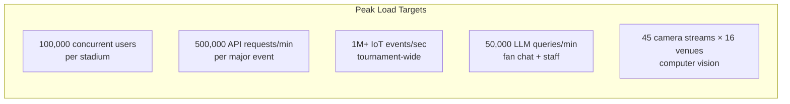

### 6.3 Reliability

| Component | Availability | RTO | RPO |
|-----------|-------------|-----|-----|
| Safety-critical (crowd alerts, emergency) | 99.999% | < 30s | 0 |
| Operations copilot | 99.99% | < 5min | < 1min |
| Fan app features | 99.9% | < 15min | < 5min |
| Analytics & reporting | 99.5% | < 1hr | < 15min |

### 6.4 Security

- **Zero-trust architecture** — No implicit trust between services
- **Encryption** — TLS 1.3 in transit; AES-256 at rest
- **PII minimization** — Collect only what is necessary
- **Biometric data** — No biometric processing without explicit opt-in and legal review
- **Pen testing** — Full penetration test before G3 gate (Month 8)
- **SOC 2 Type II** — Required for cloud infrastructure

---

## 7. Out of Scope

The following are explicitly **NOT** in scope for v1.0 (World Cup 2026):

- ❌ General-purpose facial recognition for crowd monitoring
- ❌ Individual fan tracking without explicit opt-in
- ❌ Officiating support (Hawk-Eye is the FIFA partner for this)
- ❌ Broadcast content generation (WSC Sports covers this)
- ❌ Ticket sales & ticketing platform replacement
- ❌ Social media management tools
- ❌ Team performance analytics (coaching tools)
- ❌ Post-tournament commercial stadium operations (Phase 6 legacy roadmap item)

---

## 8. Prioritization Matrix

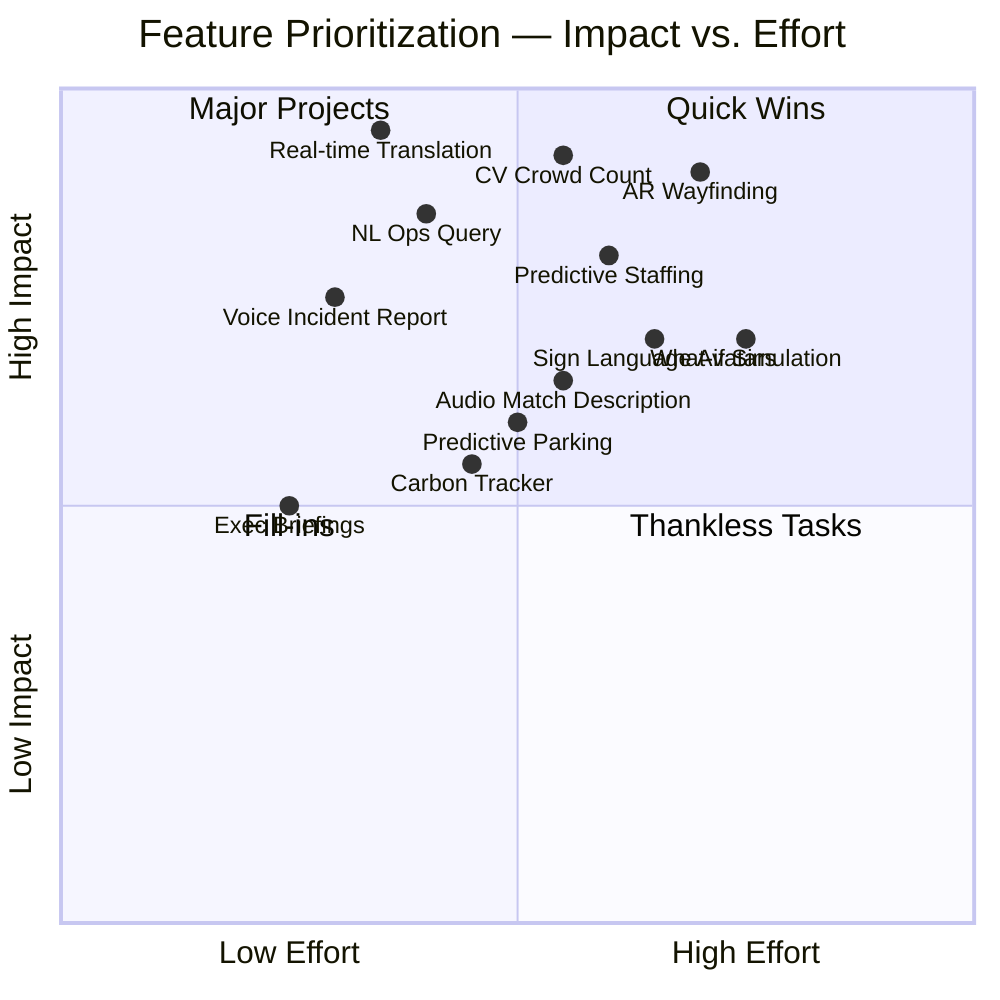

**Priority Legend:**
- **P0 (Must Have):** Blocks tournament launch if missing
- **P1 (Should Have):** Significant value; include if feasible
- **P2 (Nice to Have):** Enhances experience; descoped if behind schedule

---

## 9. Release Plan

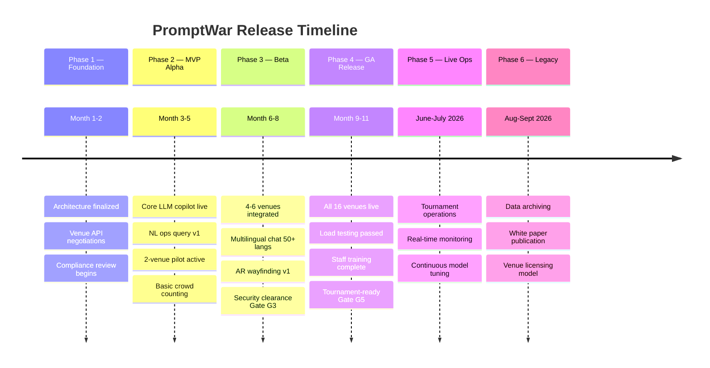

### 9.1 Go/No-Go Gates

| Gate | Criteria | Target Month |
|------|----------|-------------|
| G1: Architecture | FIFA tech team approval; venue integration specs | Month 2 |
| G2: Pilot Success | >80% user satisfaction; <100ms edge latency at 2 venues | Month 5 |
| G3: Security Clearance | Pen test complete; PIPEDA/CCPA/LFPDPPP approvals | Month 8 |
| G4: Scale Readiness | 100K concurrent users load tested; failover verified | Month 10 |
| G5: Tournament Ready | All staff trained; 24/7 NOC staffed; incident response rehearsed | Month 11 |

---

## 10. Risks & Mitigations

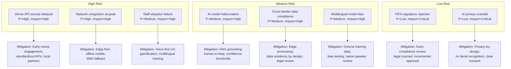

---

## 11. Open Questions

| # | Question | Owner | Due |
|---|----------|-------|-----|
| Q1 | Which LLM provider is primary — OpenAI, Anthropic, or Google? Will we multi-vendor? | AI Lead | Month 1 |
| Q2 | Will FIFA provide direct API access to player tracking / connected ball data? | FIFA Liaison | Month 2 |
| Q3 | What is the data retention policy for anonymized operational data post-tournament? | Privacy Officer | Month 2 |
| Q4 | Will the volunteer app require offline mode on organizer-provided devices? | Product | Month 1 |
| Q5 | Is the AR wayfinding feature gated behind a hardware requirement (ARCore/ARKit)? | Mobile Lead | Month 3 |
| Q6 | How do we handle sign language interpretation accuracy for safety-critical messages? | Accessibility Lead | Month 3 |
| Q7 | What is the commercialization model post-2026? SaaS licensing to venues? | Product Director | Month 6 |
| Q8 | How do we ensure AI recommendations cannot be used as evidence in litigation? | Legal | Month 2 |

---

*Document prepared by the PromptWar Product Team.*  
*Next Review: Month 1 Architecture Gate (G1)*
