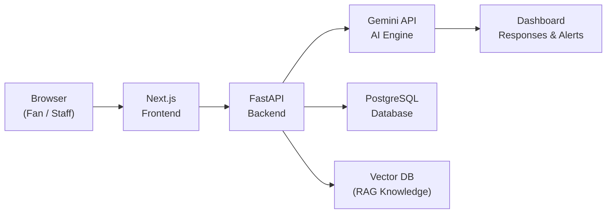

# 🏟️ PromptWar — GenAI Smart Stadium Orchestration Platform
### FIFA World Cup 2026 · Google for Developers Challenge

<div align="center">


**The first working version of a future enterprise platform** — an AI-powered Smart Stadium Command Center built for the FIFA World Cup 2026.

</div>

---

## 🌍 Project Overview

**PromptWar** is a **Generative AI-enabled, unified smart stadium MVP** built for the **FIFA World Cup 2026**. 

Rather than building isolated point solutions, PromptWar demonstrates a **single AI operations brain** that integrates navigation, crowd management, multilingual assistance, and real-time decision support into one cohesive ecosystem. This MVP focuses on a single venue (**AT&T Stadium Demo**) to showcase how Gemini AI can revolutionize stadium operations and fan experiences.

> **Note on Simulation**: For demonstration purposes, this MVP uses **simulated IoT data, mock CCTV feeds, JSON datasets, demo venue maps, and sample incidents** instead of live FIFA infrastructure.

---

## ⚡ Problem & Solution

### The Problem
During massive events like the FIFA World Cup, stadium operations are typically siloed. Fans struggle with navigation and language barriers, while staff deal with disconnected dashboards and manual incident reporting. 

### The Solution
We built PromptWar to orchestrate everything through Generative AI. By leveraging the Gemini API, we transform complex stadium data into a natural language interface for both fans and staff.

---

## ✨ Demo Features (Core MVP)

This MVP focuses on the five most impactful features that can be demonstrated within a single stadium environment:

1. **AI Operations Copilot**
   - Powered by Gemini API
   - Natural language queries for stadium staff
   - Automated incident summaries and recommendations

2. **Crowd Analytics Dashboard**
   - Simulated crowd heatmap and live crowd density
   - Predicted congestion warnings
   - Real-time incident timeline

3. **Fan Navigation Assistant**
   - Interactive demo map with AI navigation
   - Seat finder and dynamic routing to nearest restroom/food
   - Accessibility-first routing (avoiding stairs/crowds)

4. **Voice Incident Reporting**
   - Speech-to-text integration for quick staff reporting
   - AI-driven incident classification
   - Auto-generated reports and dashboard notifications

5. **Accessibility & Multilingual Assistant**
   - Real-time translation for global fans
   - Voice assistance for hands-free queries
   - Personalized accessibility recommendations

---

## 🏗️ Architecture & Tech Stack

PromptWar is built using a modern, lightweight, and scalable stack perfect for a hackathon MVP.



### Technology Stack
- **Frontend**: Next.js, TypeScript, Tailwind CSS, Shadcn UI, Framer Motion
- **Backend**: FastAPI, Python
- **Database**: PostgreSQL
- **AI**: Gemini API, RAG, ChromaDB (Vector DB)
- **Deployment**: Vercel (Frontend), Railway (Backend)

---

## 📸 Screenshots

*(Placeholders for demo screenshots)*
- `[Dashboard - AI Operations Copilot]`
- `[Dashboard - Crowd Heatmap]`
- `[Mobile View - Fan Navigation Assistant]`

## 🎥 Demo Video

*(Placeholder for YouTube / Loom Demo Link)*
- `[Watch the PromptWar MVP in action here]`

---

## 🚀 Installation & Local Setup

### Prerequisites
- Node.js >= 20.x
- Python >= 3.11
- PostgreSQL (or Docker)

### Clone & Install

```bash
git clone https://github.com/your-org/promptwar.git
cd promptwar

# Backend Setup (FastAPI)
cd backend
python -m venv venv
source venv/bin/activate  # On Windows use `venv\Scripts\activate`
pip install -r requirements.txt

# Frontend Setup (Next.js)
cd ../frontend
npm install
```

### Environment Setup

```bash
cp .env.example .env
# Configure: GEMINI_API_KEY, DATABASE_URL, etc.
```

### Run Locally

```bash
# Start Backend
cd backend
uvicorn main:app --reload

# Start Frontend (in a new terminal)
cd frontend
npm run dev
```

---

## 🔮 Future Scope

While this MVP focuses on a single simulated stadium, the vision for PromptWar extends to a multi-venue, enterprise-scale deployment. Future features include:
- Multi-region synchronization across all 16 World Cup venues
- Live integration with real IoT sensors and CCTV feeds
- Advanced predictive transport and sustainability optimization models
- Multi-cloud enterprise deployment

---

## 📁 Project Structure

```
promptwar/
├── README.md                    # You are here
├── PRD.md                       # Product Requirements Document
├── TRD.md                       # Technical Requirements Document
├── AI_WORKFLOW.md               # AI Workflow & Architecture
├── Research_PromptWar.md        # Pre-build research & context
│
├── frontend/                    # Next.js web application
└── backend/                     # FastAPI backend & AI services
```

---

<div align="center">

Built with love for the **Google for Developers FIFA World Cup 2026 Challenge**

*Transforming stadiums into intelligent, AI-powered fan experiences.*

</div>