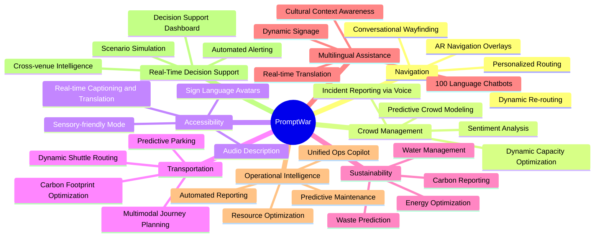
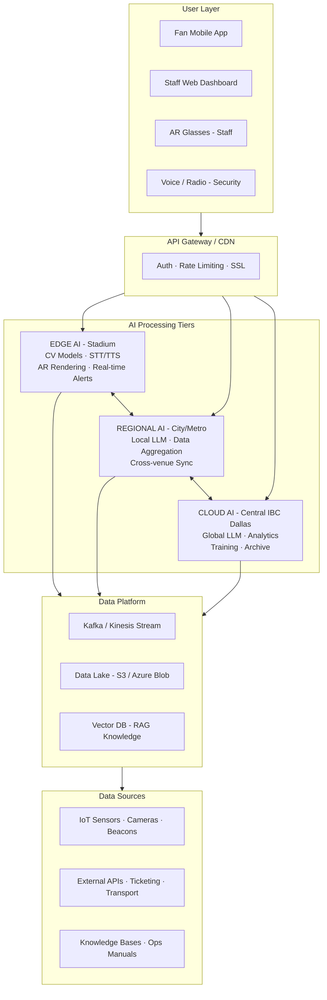
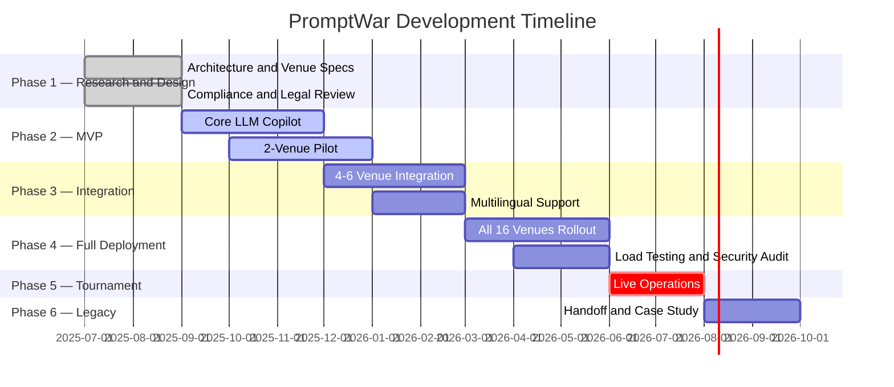
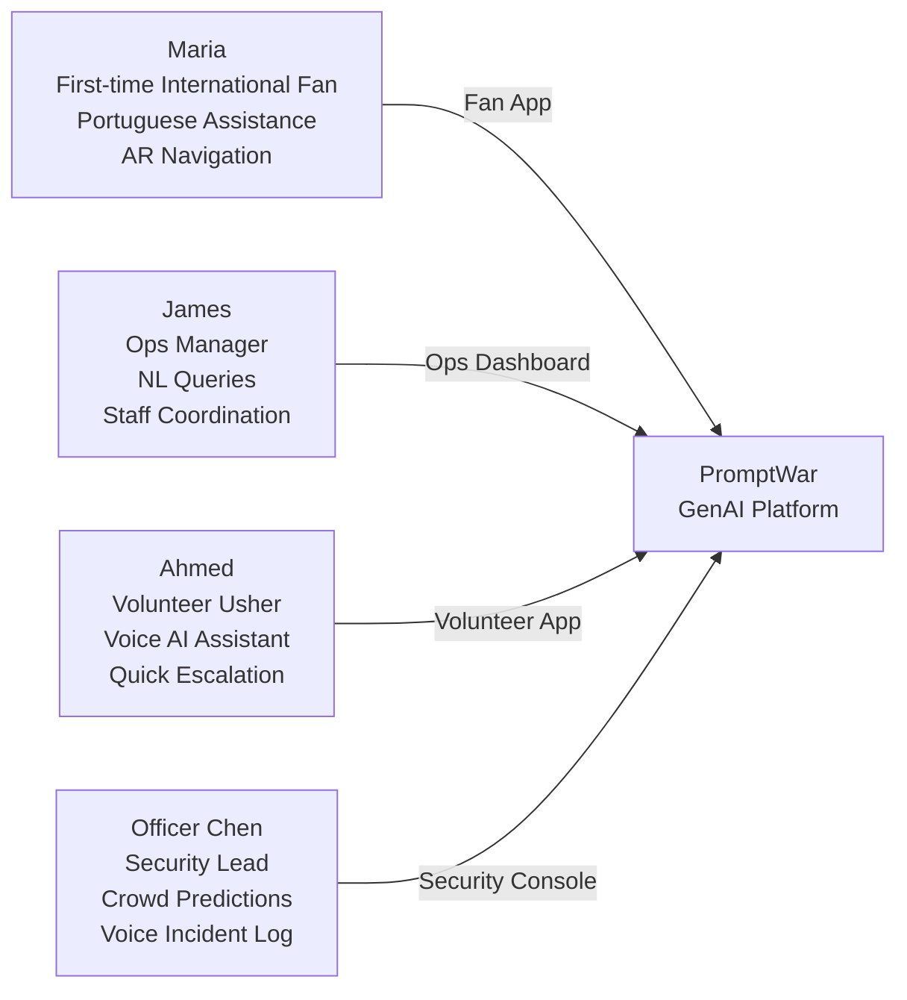

# 🏟️ PromptWar — GenAI Smart Stadium Orchestration Platform
### FIFA World Cup 2026 · Google for Developers Challenge

<div align="center">


**The world's first GenAI-native stadium operations orchestration platform** — purpose-built for the largest sporting event in history.

</div>

---

## 🌍 What Is PromptWar?

**PromptWar** is a **Generative AI-enabled, unified smart stadium platform** built for the **FIFA World Cup 2026** — spanning **48 teams, 104 matches, 16 venues** across the United States, Canada, and Mexico.

Rather than building isolated point solutions, PromptWar creates a **single AI operations brain** that integrates navigation, crowd management, multilingual assistance, sustainability tracking, transportation optimization, and real-time decision support into one cohesive ecosystem.

> **The Smart Stadium market is projected to grow from $22.1B (2025) → $38.69B by 2029.**  
> PromptWar positions itself at the leading edge of this transformation.

---

## ⚡ Eight Core Problem Domains



---

## 🏗️ High-Level Architecture



---

## 🎯 Tournament Scale

| Parameter | Value |
|-----------|-------|
| Host Nations | United States · Canada · Mexico |
| Venues | 16 Stadiums across 16 Cities |
| Matches | 104 (48 Teams) |
| In-Stadium Attendance | 3.5M+ fans |
| Broadcast Audience | 5 Billion+ |
| Network per Stadium | ~600 Gbps capacity |
| Cameras per Match | ~45 |
| Concurrent App Users | 100,000+ per stadium |

---

## 🚀 Quick Start

### Prerequisites

```bash
# Required
node >= 20.x
python >= 3.11
docker >= 24.x
kubectl >= 1.28
```

### Clone & Install

```bash
git clone https://github.com/your-org/promptwar.git
cd promptwar

# Backend services
pip install -r requirements.txt

# Frontend fan app
cd apps/fan-mobile && npm install

# Operations dashboard
cd apps/ops-dashboard && npm install
```

### Environment Setup

```bash
cp .env.example .env
# Configure: OPENAI_API_KEY, GOOGLE_API_KEY, AWS credentials, etc.
```

### Run Locally

```bash
# Start all services with Docker Compose
docker compose up -d

# Or run individual services
python -m uvicorn services.copilot.main:app --reload
npm run dev --workspace=apps/fan-mobile
```

---

## 📁 Project Structure

```
promptwar/
├── README.md                    # You are here
├── PRD.md                       # Product Requirements Document
├── TRD.md                       # Technical Requirements Document
├── AI_WORKFLOW.md               # AI/ML Workflow & Agent Design
│
├── apps/
│   ├── fan-mobile/              # React Native fan-facing app
│   ├── ops-dashboard/           # Next.js operations control center
│   └── volunteer-app/           # Simplified staff/volunteer app
│
├── services/
│   ├── copilot/                 # Central LLM operations copilot
│   ├── navigation/              # AI wayfinding microservice
│   ├── crowd-analytics/         # Computer vision crowd service
│   ├── translation/             # Multilingual NLP service
│   ├── transport/               # Multimodal transport optimizer
│   ├── sustainability/          # Energy & waste AI service
│   └── gateway/                 # API gateway & auth
│
├── ml/
│   ├── models/                  # Fine-tuned model configs
│   ├── training/                # Training pipelines
│   ├── evaluation/              # Bias & accuracy tests
│   └── rag/                     # RAG knowledge base configs
│
├── infrastructure/
│   ├── terraform/               # Multi-cloud IaC
│   ├── k8s/                     # Kubernetes manifests
│   └── edge/                    # Edge AI deployment configs
│
└── docs/
    ├── venue-integrations/      # Per-venue API specs
    ├── compliance/              # Regulatory documentation
    └── runbooks/                # Ops runbooks
```

---

## 🤖 Key AI Capabilities

| Capability | Technology | Latency Target |
|------------|------------|---------------|
| Multilingual Chat (100+ langs) | Gemini / GPT-4o + RAG | < 500ms |
| Crowd Density Detection | YOLOv8 + Custom CV | < 50ms |
| Voice Incident Reporting | Whisper v3 STT | < 200ms |
| AR Wayfinding | ARCore/ARKit + LLM | < 100ms |
| Predictive Transport | LSTM + ARIMA | < 1s |
| Sign Language Avatars | TTS + Avatar Gen | < 300ms |
| Ops Natural Language Query | LangChain + RAG | < 500ms |
| Carbon Footprint Tracking | Analytical AI | Batch |

---

## 🗓️ Development Roadmap



---

## 👥 Stakeholder Personas



---

## 🔐 Privacy & Compliance

| Region | Framework | Key Requirement |
|--------|-----------|----------------|
| United States | CCPA/CPRA · ADA | Fan data rights, accessibility, biometric consent (BIPA) |
| Canada | PIPEDA · AODA | Cross-border restrictions, explicit consent |
| Mexico | LFPDPPP | Sensitive data handling, cross-border transfers |
| Global | EU AI Act (indirect) | High-risk AI accountability, explainability |

**Core Privacy Principles:**
- No facial recognition for general crowd monitoring
- Aggregate analytics only (privacy-preserving CV)
- Data residency: each country's fan data stays in-country
- Transparent AI disclosure to all users

---

## 🌱 Sustainability Commitment

- **Energy:** AI-optimized HVAC and lighting reduces venue energy by up to 20%
- **Waste:** Predictive waste modeling enables dynamic bin routing
- **Carbon:** Automated footprint tracking per-venue with reduction recommendations
- **Legacy:** All hardware must serve venues post-tournament (no e-waste)

---

## 📚 Documentation

| Document | Description |
|----------|-------------|
| [PRD.md](./PRD.md) | Product Requirements — features, personas, success metrics |
| [TRD.md](./TRD.md) | Technical Requirements — architecture, APIs, infrastructure |
| [AI_WORKFLOW.md](./AI_WORKFLOW.md) | AI agent design, RAG pipelines, model selection |
| [Research_PromptWar.md](./Research_PromptWar.md) | Full pre-build research document |

---

## 🤝 Contributing

1. Fork the repository
2. Create your feature branch: `git checkout -b feature/crowd-analytics-v2`
3. Commit your changes: `git commit -m 'feat: add real-time crowd density heatmap'`
4. Push to the branch: `git push origin feature/crowd-analytics-v2`
5. Open a Pull Request

---

## 📄 License

This project is licensed under the **MIT License** — see [LICENSE](./LICENSE) for details.

---

<div align="center">

Built with love for the **Google for Developers FIFA World Cup 2026 Challenge**

*Transforming 16 stadiums into intelligent, AI-powered fan experiences.*

</div>
# FIFA-World-Cup-2026-Google-for-Developers-Challenge

