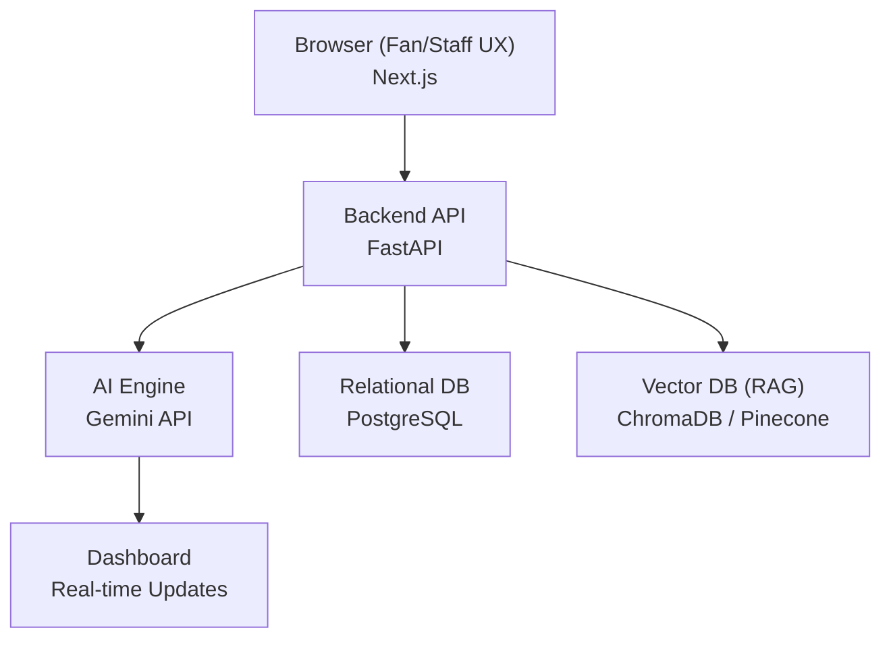

# ⚙️ Technical Requirements Document (TRD)
## PromptWar — GenAI Smart Stadium Orchestration Platform
### FIFA World Cup 2026 · Google for Developers Challenge

**Document Version:** 1.0  
**Status:** Hackathon MVP  
**Classification:** Public Demo

---

## Table of Contents

1. [System Overview](#1-system-overview)
2. [Architecture Design](#2-architecture-design)
3. [Technology Stack](#3-technology-stack)
4. [Data Architecture & Simulation](#4-data-architecture--simulation)
5. [API Design](#5-api-design)

---

## 1. System Overview

PromptWar is a GenAI-enabled smart stadium orchestration MVP. The system is designed to showcase how Generative AI (Gemini) can transform stadium operations within a single venue (**AT&T Stadium Demo**). The focus is on rapid development, clean UX, and powerful AI integration using a modern web stack.

---

## 2. Architecture Design

The hackathon architecture prioritizes simplicity and speed, removing the overhead of enterprise microservices and multi-cloud infrastructure.

### Data Flow
1. **Fan/Staff Input**: User interacts with the Next.js frontend (text or voice).
2. **API Layer**: FastAPI processes the request and orchestrates the logic.
3. **RAG / Knowledge Retrieval**: If domain knowledge (like venue maps or incident logs) is needed, FastAPI queries the Vector DB.
4. **AI Processing**: The Gemini API processes the prompt, context, and user input to generate a response, classification, or recommendation.
5. **Storage & Output**: Results are saved to PostgreSQL and pushed back to the frontend dashboard.

---

## 3. Technology Stack

We have selected a streamlined, developer-friendly stack to build the MVP quickly.

### Frontend
- **Framework**: Next.js (React)
- **Language**: TypeScript
- **Styling**: Tailwind CSS
- **UI Components**: Shadcn UI
- **Animations**: Framer Motion

### Backend
- **Framework**: FastAPI
- **Language**: Python
- **Database**: PostgreSQL
- **Vector DB**: ChromaDB (local) or Pinecone (cloud)

### AI & Integration
- **LLM**: Gemini API (Google AI Studio)
- **Speech-to-Text**: Web Speech API / standard STT libraries
- **Deployment**: Vercel (Frontend), Railway or Render (Backend)

---

## 4. Data Architecture & Simulation

To demonstrate the platform without live stadium infrastructure, all data feeds are simulated.

### Simulated Data Sources
- **IoT & Crowd Data**: JSON datasets representing crowd counts, density percentages, and gate flow.
- **Incident Logs**: A predefined set of sample incidents (e.g., "Medical emergency at Section 104", "Spill at Gate C") to populate the dashboard and test the AI Copilot.
- **Venue Map**: A structured JSON representation of the demo stadium layout, used by the RAG system to provide navigation advice.

### RAG Pipeline
1. **Document Ingestion**: Demo venue maps, FAQ documents, and sample operations manuals are embedded.
2. **Vector Storage**: Embeddings are stored in the Vector DB.
3. **Retrieval**: When a fan asks "Where is the nearest restroom?", the backend retrieves the venue layout and passes it to Gemini to generate natural language directions.

---

## 5. API Design

The FastAPI backend exposes clean REST endpoints for the Next.js frontend.

| Endpoint | Method | Purpose |
|----------|--------|---------|
| `/api/chat` | POST | Send user query to Gemini + RAG and get response |
| `/api/incidents` | GET | Retrieve list of simulated incidents for the dashboard |
| `/api/incidents/report` | POST | Submit voice-to-text string for AI classification & logging |
| `/api/crowd/density` | GET | Retrieve simulated crowd heatmap data |
| `/api/copilot/query` | POST | Ops manager NL query (e.g., "Summarize current crowd risks") |

---

*This TRD represents the hackathon MVP scope. Enterprise architectures involving Kubernetes, Edge AI, and Kafka are reserved for future phases.*
