# ⚙️ Technical Requirements Document (TRD)
## PromptWar — GenAI Smart Stadium Orchestration Platform
### FIFA World Cup 2026 · Google for Developers Challenge

**Document Version:** 1.0  
**Date:** July 2026  
**Status:** Draft — Pending Architecture Review  
**Owner:** Solution Architecture Team  
**Classification:** Internal

---

## Table of Contents

1. [System Overview](#1-system-overview)
2. [Architecture Design](#2-architecture-design)
3. [Infrastructure Requirements](#3-infrastructure-requirements)
4. [AI/ML Technical Specifications](#4-aiml-technical-specifications)
5. [Data Architecture](#5-data-architecture)
6. [API Design](#6-api-design)
7. [Security Architecture](#7-security-architecture)
8. [Scalability & Performance](#8-scalability--performance)
9. [Integration Requirements](#9-integration-requirements)
10. [DevOps & MLOps](#10-devops--mlops)
11. [Compliance & Regulatory Requirements](#11-compliance--regulatory-requirements)
12. [Technology Stack Summary](#12-technology-stack-summary)

---

## 1. System Overview

### 1.1 System Context

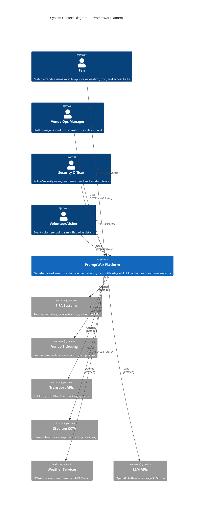

### 1.2 Architecture Principles

| Principle | Implementation |
|-----------|---------------|
| **Edge-First** | CV, AR, STT/TTS at stadium edge (<50ms); LLM queries at regional/cloud |
| **Multi-Cloud Resilience** | AWS (US), Azure (Canada), GCP (Mexico) with cross-region failover |
| **Data Sovereignty** | Fan data processed and stored within their country; no cross-border PII |
| **Offline-First Mobile** | Cached maps, offline AI models, graceful degradation |
| **Modular Microservices** | Each AI feature is an independent service with clear API contracts |
| **Human-in-the-Loop** | All safety-critical AI outputs require human review/approval |
| **Privacy by Design** | No facial recognition; aggregate analytics; explicit consent |

---

## 2. Architecture Design

### 2.1 Layered Architecture

```mermaid
graph TB
    subgraph L1["Layer 1: Presentation"]
        A1["Fan Mobile App\nReact Native"]
        A2["Ops Dashboard\nNext.js"]
        A3["Volunteer App\nReact Native"]
        A4["Security Console\nNext.js"]
    end

    subgraph L2["Layer 2: API Gateway"]
        B1["Kong API Gateway\nAuth · Rate Limit · Routing"]
        B2["CDN\nCloudFront / Azure CDN"]
        B3["WebSocket Server\nReal-time Events"]
    end

    subgraph L3["Layer 3: Microservices"]
        C1["Copilot Service\nLangChain + LLM"]
        C2["Navigation Service\nRAG + Mapbox"]
        C3["Crowd Analytics\nCV + YOLOv8"]
        C4["Translation Service\nWhisper + GPT"]
        C5["Transport Service\nPredictive ML"]
        C6["Sustainability Service\nAnalytical AI"]
        C7["Notification Service\nPush + SMS"]
        C8["Auth Service\nJWT + OAuth2"]
    end

    subgraph L4["Layer 4: AI Tier"]
        D1["Edge AI\nNVIDIA Jetson / Edge TPU\n< 50ms"]
        D2["Regional LLM\nSelf-hosted Llama/Mistral\n< 200ms"]
        D3["Cloud LLM\nGPT-4o / Gemini\n< 500ms"]
    end

    subgraph L5["Layer 5: Data Platform"]
        E1["Kafka / Kinesis\nStream Processing"]
        E2["Apache Flink\nReal-time Analytics"]
        E3["Data Lake\nS3 / Azure Blob"]
        E4["Vector DB\nPinecone / Weaviate"]
        E5["PostgreSQL\nOperational DB"]
        E6["Redis\nCache / Sessions"]
    end

    subgraph L6["Layer 6: Data Sources"]
        F1["IoT Sensors\nBeacons, People Counters"]
        F2["CCTV Cameras\n45/stadium via RTSP"]
        F3["External APIs\nFIFA, Transport, Weather"]
        F4["POS Systems\nConcessions Data"]
    end

    L1 --> L2
    L2 --> L3
    L3 --> L4
    L3 --> L5
    L4 --> L5
    L5 --> L6
```

### 2.2 Edge AI Architecture (Per Stadium)

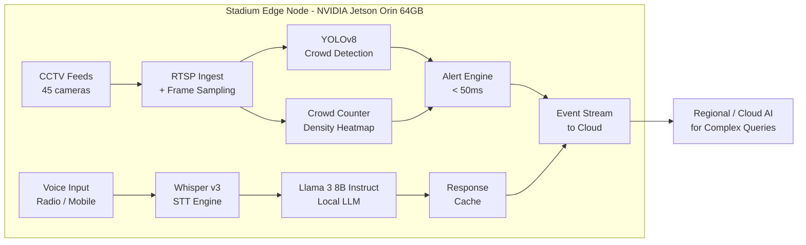

### 2.3 Multi-Region Deployment

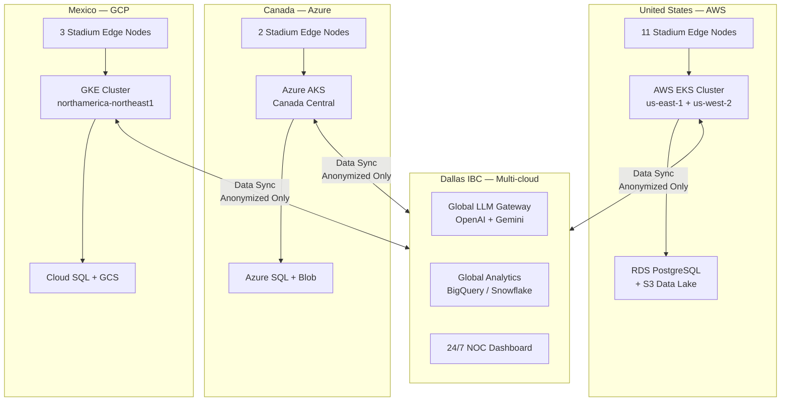

---

## 3. Infrastructure Requirements

### 3.1 Edge Computing (Per Stadium)

| Component | Specification | Count per Stadium |
|-----------|--------------|-------------------|
| Edge AI Server | NVIDIA Jetson Orin 64GB or equivalent | 2 (primary + hot standby) |
| GPU Inference | NVIDIA A100 or RTX 4090 workstation | 1 |
| Local Storage | NVMe SSD 8TB RAID-1 | 2 |
| Network | Dual 10Gbps NICs connected to FIFA 600Gbps | 2 |
| UPS Backup | 4-hour battery backup | 1 |
| OS | Ubuntu 22.04 LTS + CUDA 12.x | — |

### 3.2 Cloud Infrastructure (Per Region)

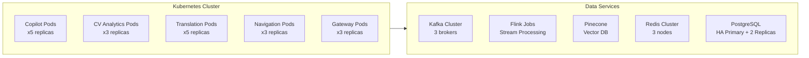

### 3.3 Network Requirements

| Link | Specification | Purpose |
|------|------------|---------|
| Stadium → Cloud | 600Gbps (FIFA-provided) | Primary data path |
| Cloud Region ↔ IBC | 10Gbps dedicated | Cross-region sync |
| Edge Node → Cloud | 10Gbps | Real-time streaming |
| Fan Mobile | 5G / Stadium WiFi | App connectivity |
| Staff Devices | Private LTE | Mission-critical communications |

---

## 4. AI/ML Technical Specifications

### 4.1 Model Selection Matrix

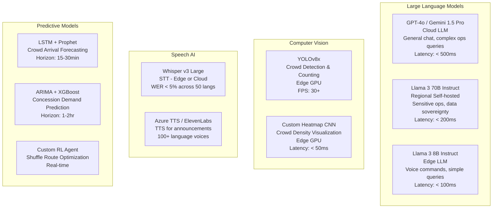

### 4.2 RAG (Retrieval-Augmented Generation) Architecture

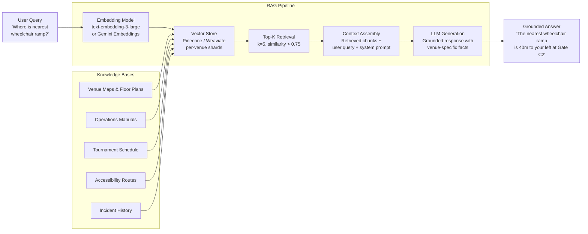

### 4.3 Model Fine-tuning Pipeline

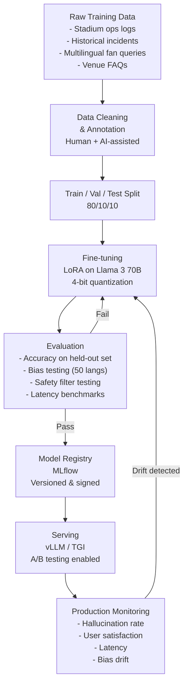

### 4.4 Computer Vision Pipeline

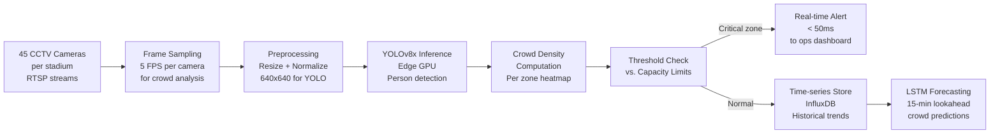

---

## 5. Data Architecture

### 5.1 Data Flow

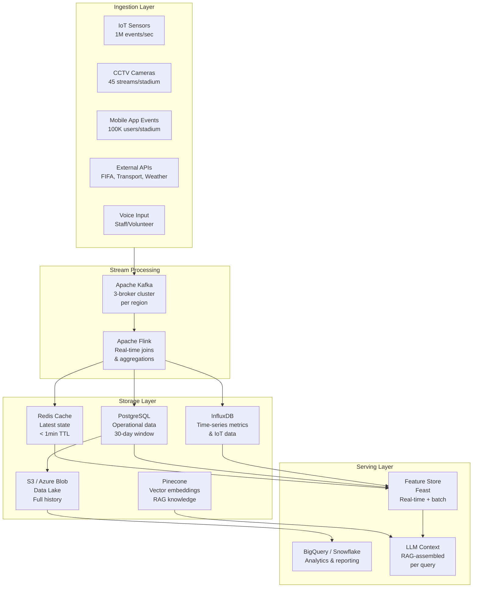

### 5.2 Data Schema — Key Entities

#### Crowd Event (IoT → Kafka topic: `crowd.events`)

```json
{
  "event_id": "uuid-v4",
  "timestamp": "ISO-8601",
  "venue_id": "ATT-DALLAS",
  "zone_id": "SECTION-114",
  "event_type": "DENSITY_UPDATE | THRESHOLD_BREACH | INCIDENT",
  "density": 0.78,
  "count_estimate": 342,
  "confidence": 0.94,
  "source": "CV_CAMERA | IOT_BEACON",
  "camera_ids": ["CAM-114-A", "CAM-114-B"],
  "metadata": {}
}
```

#### Fan Session (Mobile → Kafka topic: `fan.sessions`)

```json
{
  "session_id": "uuid-v4",
  "user_id": "hashed-anonymized-id",
  "timestamp": "ISO-8601",
  "venue_id": "ATT-DALLAS",
  "language": "pt-BR",
  "event_type": "NAVIGATION_REQUEST | CHAT_QUERY | AR_SESSION",
  "query": "optional - natural language",
  "location": { "lat": null, "lon": null, "zone": "GATE-C" },
  "accessibility_profile": "WHEELCHAIR | VISUAL | AUDIO | NONE",
  "device_type": "iOS | ANDROID",
  "app_version": "2.1.0"
}
```

### 5.3 Data Privacy Architecture

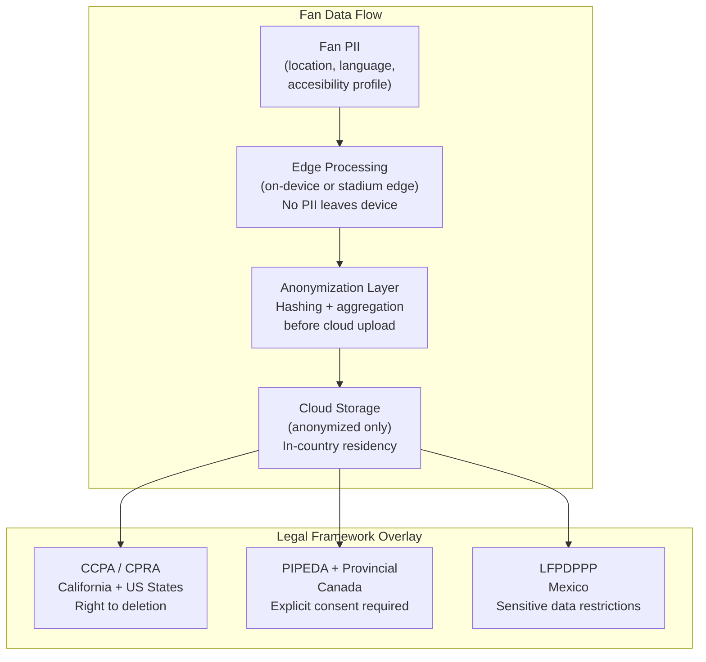

---

## 6. API Design

### 6.1 REST API Structure

| Endpoint Group | Base Path | Auth | Rate Limit |
|---------------|-----------|------|-----------|
| Fan Chat | `/api/v1/chat` | JWT Bearer | 60 req/min/user |
| Navigation | `/api/v1/navigation` | JWT Bearer | 120 req/min/user |
| Crowd Status | `/api/v1/crowd` | Service Token | 300 req/min/service |
| Operations Copilot | `/api/v1/ops/query` | Staff JWT | 120 req/min/user |
| Incident Reporting | `/api/v1/ops/incidents` | Staff JWT | 30 req/min/user |
| Sustainability | `/api/v1/sustainability` | Service Token | 60 req/min |
| Transport | `/api/v1/transport` | JWT Bearer | 60 req/min/user |

### 6.2 Key API Contracts

#### Chat API — POST `/api/v1/chat`

```yaml
Request:
  session_id: string (uuid)
  message: string (max 2000 chars)
  language: string (BCP-47, e.g. pt-BR)
  venue_id: string
  context:
    accessibility_profile: enum [WHEELCHAIR, VISUAL, AUDIO, NONE]
    current_zone: string (optional)
    query_type: enum [NAVIGATION, INFO, ACCESSIBILITY, GENERAL]

Response:
  response_id: string (uuid)
  message: string
  language: string
  confidence: float (0.0-1.0)
  sources: array[string]  # RAG source references
  latency_ms: integer
  suggested_actions:
    - type: enum [NAVIGATE, CALL_STAFF, VIEW_MAP]
      payload: object
```

#### Crowd Status — GET `/api/v1/crowd/zones/{venue_id}`

```yaml
Response:
  venue_id: string
  timestamp: ISO-8601
  zones:
    - zone_id: string
      name: string
      capacity: integer
      current_count: integer
      density: float (0.0-1.0)
      status: enum [NORMAL, WARNING, CRITICAL, EVACUATION]
      trend: enum [INCREASING, STABLE, DECREASING]
  overall_status: enum [NORMAL, ELEVATED, CRITICAL]
```

### 6.3 WebSocket Events (Real-time)

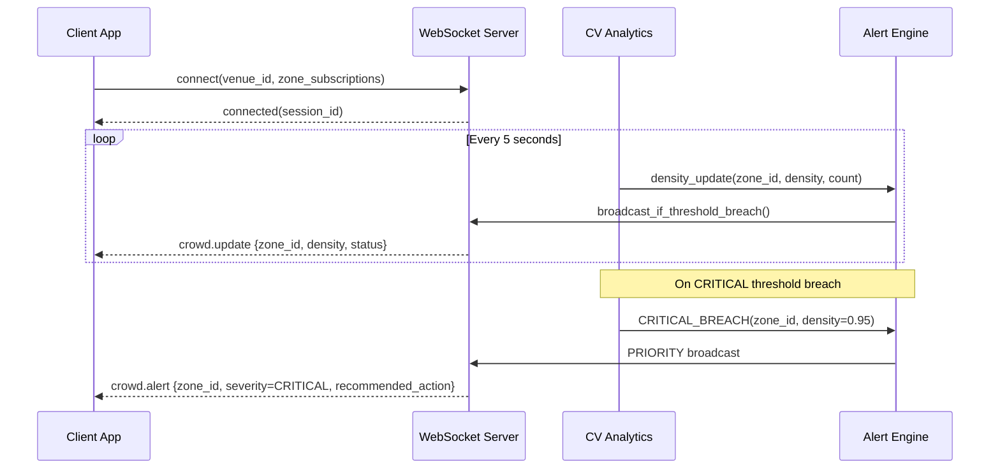

---

## 7. Security Architecture

### 7.1 Zero-Trust Security Model

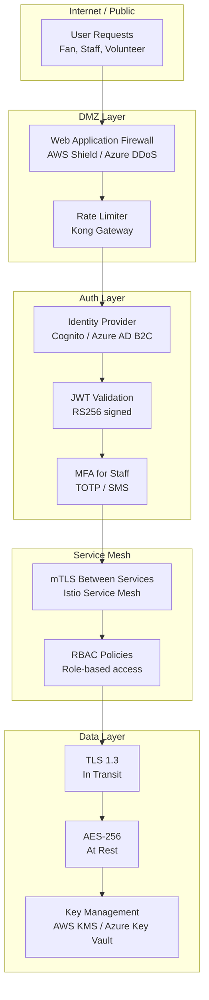

### 7.2 Secret Management

| Secret Type | Storage | Rotation |
|------------|---------|---------|
| LLM API Keys | AWS Secrets Manager / Azure Key Vault | Monthly |
| Database Credentials | HashiCorp Vault | Weekly |
| JWT Signing Keys | KMS (HSM-backed) | 90 days |
| Service-to-Service Tokens | Istio mTLS certs | 24 hours |
| Encryption Keys | KMS | Annually |

### 7.3 Security Compliance

| Standard | Requirement | Status |
|----------|-------------|--------|
| SOC 2 Type II | Cloud infrastructure audit | Required before G3 gate |
| OWASP Top 10 | All APIs and web interfaces | Continuous scanning |
| NIST CSF | Cybersecurity framework alignment | Architecture review |
| PCI DSS | If handling payment (concessions) | Scope decision needed |
| Pen Testing | Full external test | Month 8 (pre-G3) |

---

## 8. Scalability & Performance

### 8.1 Load Model

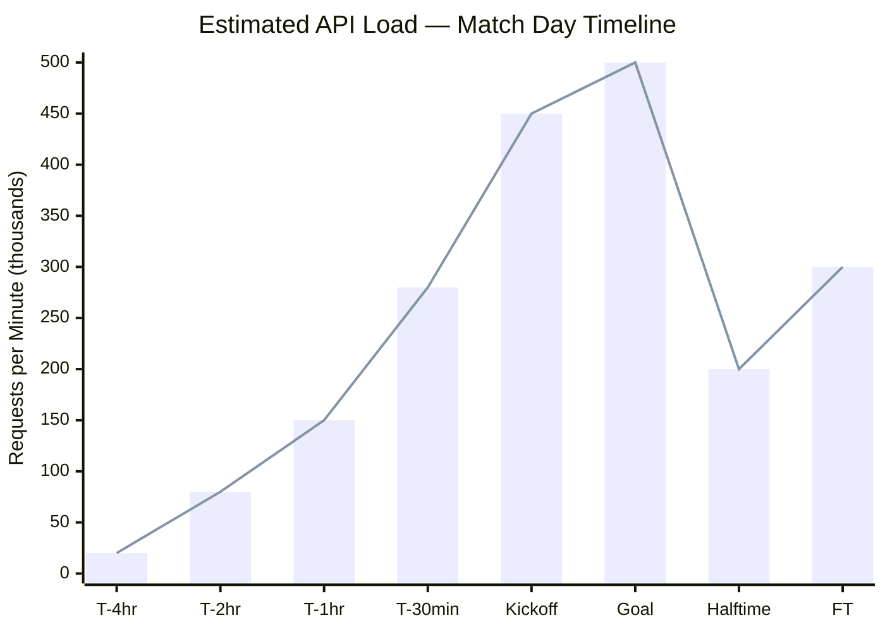

### 8.2 Auto-scaling Configuration

| Service | Min Pods | Max Pods | Scale Trigger |
|---------|---------|---------|--------------|
| Copilot / LLM | 5 | 50 | CPU > 60% or queue depth > 100 |
| CV Analytics | 3 | 20 | GPU utilization > 70% |
| Translation | 5 | 40 | Request rate > 1000 RPM |
| Navigation | 3 | 30 | CPU > 60% |
| WebSocket | 3 | 20 | Active connections > 10,000 |
| API Gateway | 3 | 15 | CPU > 50% |

### 8.3 Caching Strategy

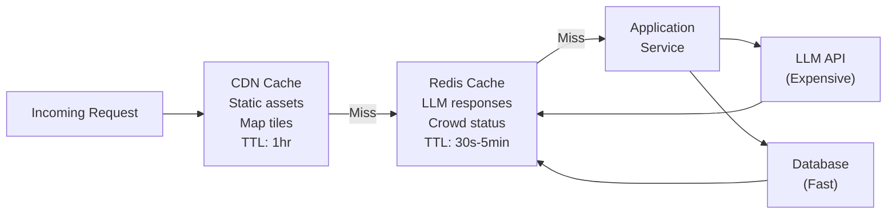

---

## 9. Integration Requirements

### 9.1 FIFA Technology Integrations

| FIFA System | Integration Type | Data | Protocol |
|------------|-----------------|------|---------|
| Player Tracking | Push / Webhook | 29 points/player @ 50Hz | HTTPS WebSocket |
| Connected Ball (Adidas Trionda) | Push | 500Hz motion sensor | HTTPS |
| SAOT (Semi-automated offside) | Read API | Offside decisions | REST API |
| Match Schedule API | Pull | Fixtures, results, updates | REST API |
| Dallas IBC Production | Event Bus | Broadcast events, match milestones | Kafka |

### 9.2 Venue System Integrations

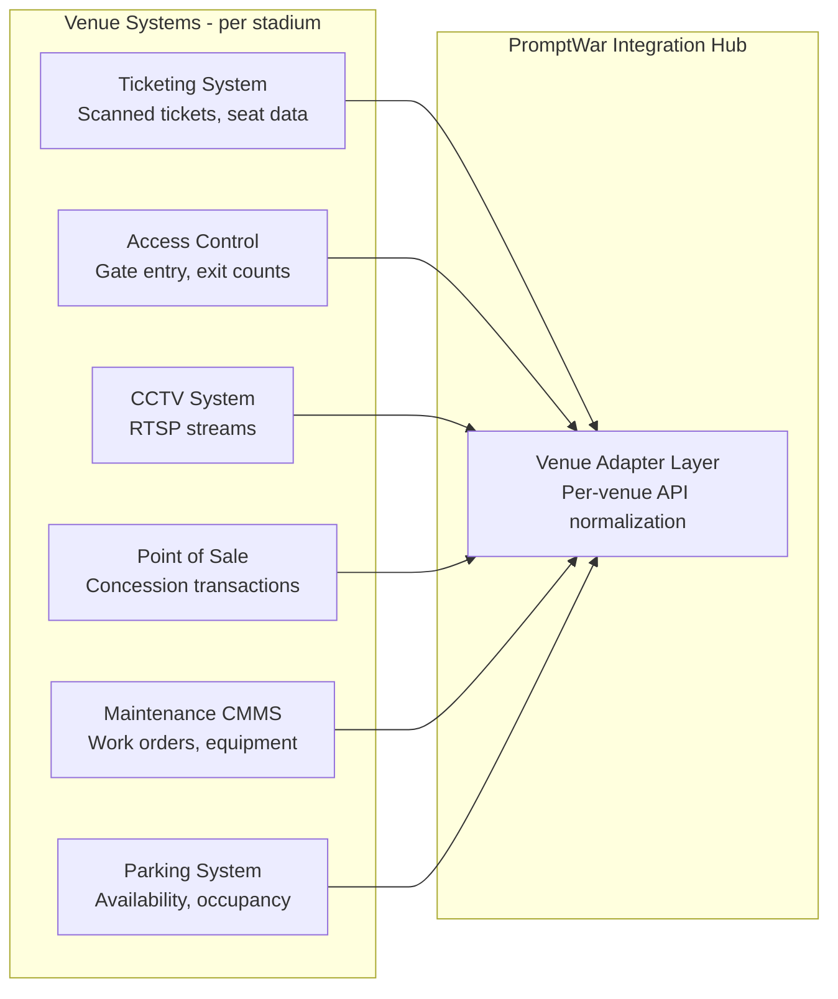

### 9.3 External Service Integrations

| Service | Provider | Use Case | SLA |
|---------|----------|---------|-----|
| LLM (Primary) | OpenAI GPT-4o | Fan chat, ops copilot | 99.9% uptime |
| LLM (Secondary) | Google Gemini 1.5 Pro | Fallback, multilingual | 99.9% uptime |
| Translation | DeepL / Google Translate API | Document translation | 99.9% uptime |
| Maps | Mapbox | Indoor + outdoor navigation | 99.9% uptime |
| SMS Fallback | Twilio | Offline fan notifications | 99.9% uptime |
| Public Transit | Local transit APIs (MTA, TTC, STE) | Multimodal journey | Best-effort |
| Ride-share | Uber / Lyft API | Post-match transport | 99% uptime |
| Weather | NOAA, Environment Canada, SMN | Forecast-aware planning | 99% uptime |
| Push Notifications | Firebase (Android) / APNs (iOS) | Fan app notifications | 99.9% uptime |

---

## 10. DevOps & MLOps

### 10.1 CI/CD Pipeline

```mermaid
flowchart LR
    subgraph DEV["Development"]
        CODE["Code Push\ngit push"] --> PR["Pull Request\nCode Review"]
        PR --> LINT["Linting +\nUnit Tests"]
    end

    subgraph CI["Continuous Integration"]
        LINT --> BUILD["Docker Build\nMulti-arch"]
        BUILD --> SCAN["Security Scan\nTrivy + Snyk"]
        SCAN --> INT_TEST["Integration Tests\nTestcontainers"]
        INT_TEST --> LOAD_TEST["Load Test\nk6 at 10K RPM"]
    end

    subgraph CD["Continuous Deployment"]
        LOAD_TEST -->|"Pass"| STAGING["Deploy to Staging\nKubernetes"]
        STAGING --> SMOKE["Smoke Tests\nAI response validation"]
        SMOKE -->|"Pass"| PROD["Deploy to Production\nBlue-Green rollout"]
        PROD --> MONITOR["Monitoring\nDatadog / Grafana"]
    end
```

### 10.2 MLOps Pipeline

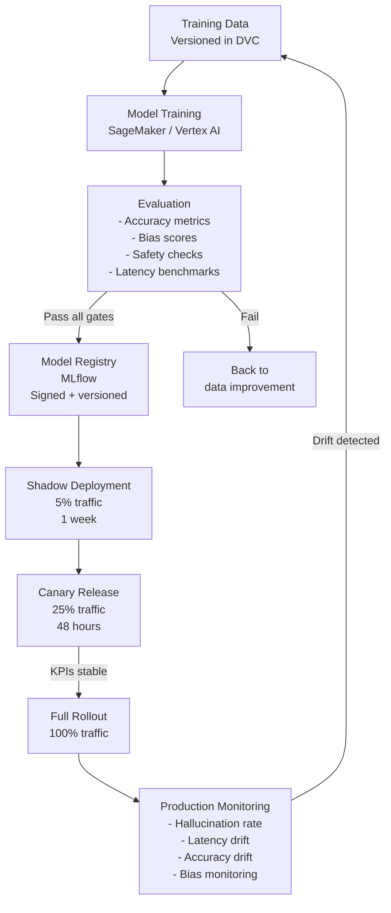

### 10.3 Observability Stack

| Layer | Tool | Metrics |
|-------|------|---------|
| Infrastructure | Datadog / CloudWatch | CPU, memory, network, disk |
| Application | Datadog APM | Request rate, error rate, latency |
| LLM/AI | Custom + Langfuse | Hallucination rate, token usage, response quality |
| Business | Grafana | Fan satisfaction, adoption, NPS |
| Security | Falco + SIEM | Anomaly detection, access logs |
| Alerting | PagerDuty | 24/7 NOC escalation |

---

## 11. Compliance & Regulatory Requirements

### 11.1 Data Privacy Requirements by Region

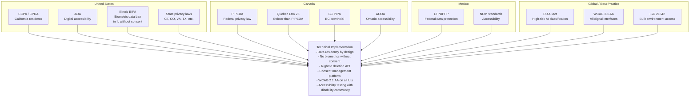

### 11.2 AI-Specific Compliance

| Requirement | Implementation |
|------------|---------------|
| AI Transparency | Clear "AI-powered" disclosure in all chat UIs |
| Explainability | All ops recommendations include "why" (e.g., "crowd density 85% because camera detects 4200 people/min") |
| Human-in-loop | Security and safety recommendations require human approval before action |
| Bias Testing | All language models tested on 50+ language pairs; CV models tested across skin tones, body types |
| Audit Logging | All AI decisions logged with model version, inputs, outputs, and confidence scores |
| Model Documentation | Model cards for all production AI models (following Google Model Card standards) |

---

## 12. Technology Stack Summary

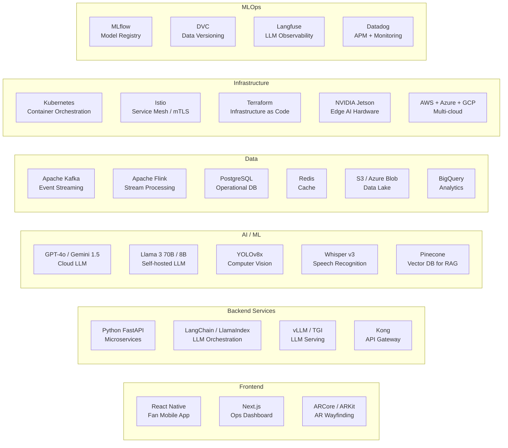

### Full Stack Reference Table

| Layer | Technology | Justification |
|-------|-----------|---------------|
| Fan Mobile | React Native | Cross-platform iOS/Android; AR support |
| Operations UI | Next.js + TypeScript | SSR, real-time dashboards |
| AR | ARCore (Android) + ARKit (iOS) | Native AR performance |
| API Gateway | Kong | Rate limiting, auth, routing at scale |
| Backend Services | Python FastAPI | Async, high-performance, ML-native |
| LLM Orchestration | LangChain + LlamaIndex | RAG, agent workflows, tool calling |
| LLM Serving | vLLM / TGI | Continuous batching, high throughput |
| Cloud LLM | GPT-4o + Gemini 1.5 Pro | Best multilingual, multimodal capability |
| Edge LLM | Llama 3 8B (4-bit quantized) | Edge-deployable, data sovereign |
| Computer Vision | YOLOv8x + OpenCV | Proven crowd detection performance |
| Speech | Whisper v3 + Azure TTS | Best STT accuracy, 100+ TTS voices |
| Vector DB | Pinecone | Managed, low-latency, scale-tested |
| Event Streaming | Apache Kafka | Industry standard, 1M+ events/sec |
| Stream Processing | Apache Flink | Sub-second latency, stateful joins |
| Operational DB | PostgreSQL + TimescaleDB | ACID, time-series extension |
| Cache | Redis Cluster | < 1ms latency for hot data |
| Data Lake | S3 / Azure Blob / GCS | Multi-cloud data residency |
| Analytics | BigQuery / Snowflake | Column-store analytics at petabyte scale |
| Containers | Kubernetes + Helm | Portable, autoscaling deployments |
| Service Mesh | Istio | mTLS, traffic management, observability |
| IaC | Terraform | Multi-cloud infrastructure management |
| Edge Hardware | NVIDIA Jetson Orin | GPU-accelerated CV at stadium edge |
| CI/CD | GitHub Actions + ArgoCD | GitOps, automated deployments |
| Model Registry | MLflow | Model versioning, A/B testing |
| Observability | Datadog + Grafana + Langfuse | Full-stack + LLM-specific monitoring |
| Security | Falco + Snyk + AWS Shield | Runtime security + dependency scanning |

---

*Document prepared by the PromptWar Architecture Team.*  
*Next Review: Architecture Gate G1 — Month 2*
